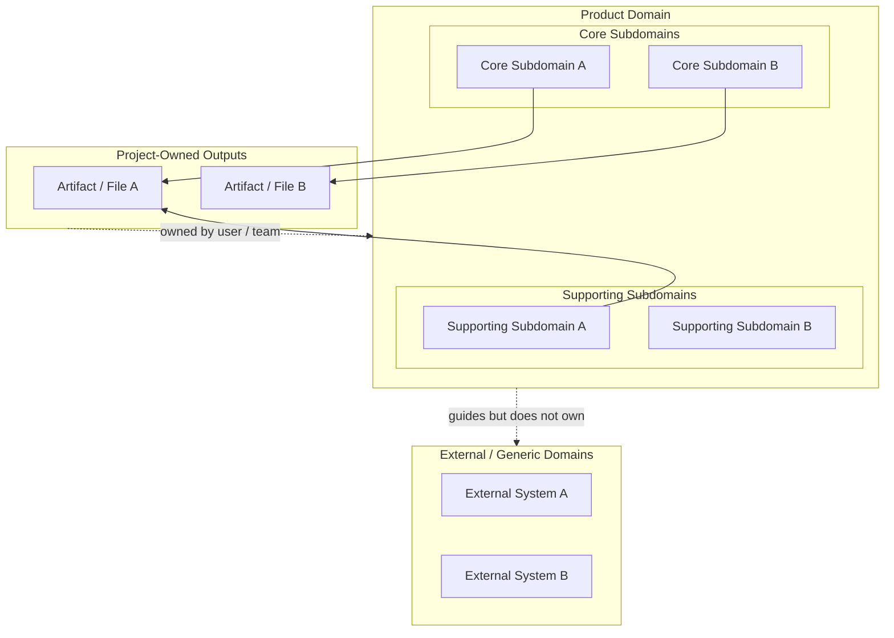

# Business Domain Model Writer

## Purpose

Create or update `docs/business-domain-model.md`, a project-owned Business Domain Model that captures the product's business language and rules before downstream planning starts.

This skill owns the Business Domain Model only. It does not own Product Vision, Deep Module Maps, feature briefs, UX specs, technical designs, Epics, User Stories, implementation plans, production code, or Sibu template changes.

## Pipeline Contract

### What this skill needs

- `docs/product-vision.md`.
- Existing `docs/business-domain-model.md` when revising the model.
- Assistant-generated domain hypotheses grounded in Product Vision, then user review/corrections for concrete examples, scenarios, workflows, rules, states, events, and confusing boundaries.

### What this skill writes

- `docs/business-domain-model.md`.

This is generated project-owned content. It is not a Sibu-managed workflow template.

### When this skill stops

- `docs/product-vision.md` is missing; tell the user to create it first with `product-vision-writer`.
- The request belongs to another pipeline stage, such as Product Vision, Deep Module Map, feature brief, UX design, technical design, Scrum planning, implementation planning, or implementation execution.
- Product Vision plus user review still leave material ambiguity about domain language, concepts, bounded contexts, subdomains, relationships, rules, lifecycles, workflows, events, boundaries, or hard parts; ask one focused review question instead of drafting.

### What this skill must not do

- Do not create Product Vision, Deep Module Maps, feature briefs, UX specs, technical designs, Epics, User Stories, implementation plans, or production code.
- Do not inspect implementation code or derive domain truth from existing architecture, folder names, database tables, commands, screens, or APIs by default.
- Do not use existing implementation code as the source of truth for business concepts, rules, or boundaries.
- Do not make the user invent the Business Domain Model from scratch. The assistant must first mine Product Vision for likely concepts, rules, workflows, lifecycles, and boundaries, then ask the user to confirm or correct its interpretation.
- Do not ask technical or domain-modeling questions that expect the user to provide terms like entities, bounded contexts, subdomains, business objects, lifecycle states, or domain events unless the assistant has already proposed concrete candidate language in plain product terms.
- Do not skip the user review/correction pass or the final “I am clear; are you good?” check-in before writing.
- Do not write any file except `docs/business-domain-model.md` unless the user explicitly asks for a different path for this same artifact.

## Required source of truth

Before doing any Business Domain Model work, read:

```txt
docs/product-vision.md
```

Use Product Vision as the source of truth for product purpose, target user, positioning, product principles, boundaries, voice, trust expectations, and success signals.

The Business Domain Model source of truth is Product Vision plus the user's review of assistant-generated hypotheses. Repository code may be inspected only when the user explicitly requests a later code-alignment check, and only after the domain model has been drafted from Product Vision and user-reviewed context.

## Hard start rule

Do not create or update a Business Domain Model if `docs/product-vision.md` is missing.

If Product Vision is missing:

1. Stop.
2. Tell the user that a Business Domain Model requires `docs/product-vision.md`.
3. Instruct the user to create Product Vision first with `product-vision-writer`.
4. Do not draft, infer, or save a Business Domain Model until Product Vision exists.

## No-code-inspection boundary

For initial creation and substantial revisions, do not inspect implementation code by default. Do not reverse-engineer the domain model from:

- current architecture
- folders or packages
- database schemas
- command names
- UI screens
- APIs
- tests
- helper names

Those artifacts can reflect accidental implementation structure, stale terminology, or technical shortcuts. They are not business-domain truth.

If the user explicitly requests a code-alignment check, first draft the Business Domain Model from Product Vision and user-reviewed hypotheses. Then inspect code narrowly to identify terminology or migration implications, not to redefine the domain model around current implementation.

## Discovery posture

Be assistant-led before writing. The user is asking for help defining the model; do not make them supply the model.

Before asking questions, extract as much as possible from Product Vision:

- likely domain purpose
- likely user-facing and business vocabulary
- likely core concepts and relationships
- likely domain boundaries, bounded contexts, and subdomains
- likely states, lifecycles, workflows, rules, events, boundaries, and hard parts
- places where Product Vision is silent or ambiguous

Then present a concise first-pass interpretation and ask the user to correct one specific part of it. The user's job is reviewer, not author.

Use plain product language. Prefer questions like “Does this read right?” or “Which of these feels wrong?” over questions that require domain-modeling skill.

This user review pass is mandatory and non-skippable. Even when Product Vision is rich, ask at least one explicit user-facing review/correction question before drafting or writing the Business Domain Model.

Prefer proposed examples and scenarios before asking for abstract glossary terms. Derive candidate concepts and vocabulary from Product Vision, then confirm them with the user. Mine Product Vision for as many concrete examples, implied scenarios, value moments, decisions, state changes, rules, exceptions, and language boundaries as it can support before interviewing the user. Ask only for specific gaps that remain.

Ask one focused question at a time. Never ask the user to answer a list of questions, fill out a questionnaire, or respond to multiple numbered gaps in one turn. Walk down the domain decision tree branch by branch, resolving dependencies between concepts, rules, states, workflows, boundaries, and hard parts before moving on. When useful, include your recommended answer or a concise default assumption with the single question so the user can confirm, correct, or reject it quickly.

Do not optimize for the fewest questions. Optimize for ending the interview with no material open domain questions. If a question can be answered from Product Vision or an existing Business Domain Model during revision, inspect those artifacts instead of asking.

Before drafting, always perform one final check-in as a single question in the spirit of: “I am clear on my end. Are you good, or is there anything else you want to cover before I proceed?” If the user adds context, incorporate or clarify it before writing. Once the user confirms there is nothing else to cover, write without requiring a separate artifact approval step.

Start with a response shaped like this, with exactly one user-facing question:

```markdown
I’ll take the first pass from Product Vision and ask you to correct it.

My read is:
- <plain-language domain purpose>
- <likely concept/workflow/rule/lifecycle/boundary>
- <likely concept/workflow/rule/lifecycle/boundary>

First question: <one focused review question about the highest-leverage uncertainty or assumption>
```

Use review questions like:

- "My read is that the core lifecycle is `<plain lifecycle>`. Does that feel right, or would you name the moments differently?"
- "I think the main things this product tracks are `<candidate concepts>`. Which of these feels wrong or missing?"
- "Product Vision seems to imply this rule: `<plain rule>`. Is that true?"
- "I see this boundary: `<plain boundary>`. Is that the right boundary?"
- "This part is still ambiguous to me: `<specific ambiguity>`. My default assumption would be `<assumption>`. Should I use that?"

Avoid broad “tell me a real example” discovery as the first move. It makes the user invent the domain from scratch and often repeats work already captured in Product Vision. If Product Vision is too thin, first propose the most likely example or scenario from it, then ask the user to correct or fill one specific missing part.

Prefer focused gap-fill questions like:

- "Product Vision suggests this value moment: `<specific scenario>`. Is that accurate, or what part should change?"
- "I can infer `<workflow step A>` and `<workflow step C>`, but not what happens between them. What decision or handoff occurs there?"
- "I see `<candidate rule>`, but not the exception path. What should happen when `<specific exception>` occurs?"
- "What rule must always be true, even if the implementation changes?"
- "What exceptions or edge cases create business consequences rather than only technical errors?"
- "Where do people currently use inconsistent names for the same concept?"
- "What part of the domain feels hardest to explain to a new teammate?"

Ask these questions one at a time only. After each user answer, update your understanding, choose the next highest-value unresolved domain point, and ask one next question. Do not bundle follow-ups.

Avoid starting with:

- "What entities should exist?"
- "What bounded contexts should we use?"
- "What business objects change state?"
- "What domain events would matter?"
- "What database tables should model this?"
- "What services or modules should own this?"
- "How is the code structured today?"
- "What concepts should be external?"

## Gather the required domain context

Keep extracting from Product Vision and asking focused review questions until the following are clear enough to defend:

- domain purpose
- user-facing and business vocabulary
- core business concepts
- bounded contexts and subdomains
- relationships between concepts
- states and lifecycles
- business rules and invariants
- user and business workflows
- domain events
- external concepts and boundaries
- open tensions, tradeoffs, and hard parts

Do not draft with material unresolved domain questions. If the conversation stalls, offer one concise assumption for the next unresolved point and ask the user to confirm, correct, or reject it.

## Document shape

Write `docs/business-domain-model.md` in Markdown using these sections:

```markdown
# Business Domain Model

## Document Control & Context

### Executive Summary / Purpose

### Domain Scope & Boundaries

## Ubiquitous Language

### Terms and Definitions

### Synonym Clarification

## Bounded Contexts & Subdomains

### Subdomains

### Context Map

Include a subdomain-focused Mermaid diagram here, usually a `flowchart TB`, that visualizes:

- core subdomains
- supporting subdomains
- project-owned outputs or artifacts
- external/generic domains
- only the most important ownership or dependency relationships

Keep the diagram conceptual, sparse, and business-facing. Avoid drawing every operational relationship. Avoid database tables, class names, deployment nodes, or low-level service architecture.

Recommended shape:



## Domain Concepts & Conceptual Diagram
## Domain Concepts & Conceptual Diagram

### Conceptual Entities / Objects

### Attributes / Characteristics

### Relationships & Cardinality

## Domain Invariants & Business Rules

### Invariants

### Policies

## Domain Events & Behaviors

### Key Lifecycle Triggers

### Domain Events

## Out of Scope & Future Evolution

### Assumptions

### Known Variations / Debt
```

Keep the document as concise as the product allows. Simple projects may have short sections, but every section should contain useful domain guidance or explicitly state the current known absence of that concern.

### Section guidance

- **Document Control & Context** establishes why the domain is being modeled and the business boundary of the model before listing concepts.
- **Ubiquitous Language** is the shared glossary for business experts and engineers. Give every important term one strict definition. Call out synonyms, overloaded terms, and terms that mean different things in different contexts.
- **Bounded Contexts & Subdomains** names the meaningful business boundaries in the product. For simple products, a short list is fine. For complex products, classify subdomains as core, supporting, or generic. The `### Context Map` section should include a subdomain-focused Mermaid diagram that groups core subdomains, supporting subdomains, project-owned outputs, and external/generic domains. Keep the diagram business-oriented and sparse; do not draw every operational relationship, and do not turn it into infrastructure architecture.
- **Domain Concepts & Conceptual Diagram** describes business concepts, their important characteristics, and relationships/cardinality in plain business English. This is not a database schema, ORM model, or implementation design.
- **Domain Invariants & Business Rules** separates rules that must always be true from reactive policies that describe what should happen when a business condition occurs.
- **Domain Events & Behaviors** captures meaningful lifecycle triggers and past-tense business events that other parts of the business or system may care about.
- **Out of Scope & Future Evolution** records assumptions, explicitly excluded areas, known variation, unresolved debt, and business processes likely to change.

## Writing guidance

- Use the user's natural business language when it is clear and consistent.
- Make domain boundaries and subdomains explicit enough that downstream Deep Module Map and Feature Brief work can tell what domain each concern belongs to. Use the Mermaid context map to make subdomain groups and inside/outside ownership boundaries visually obvious.
- Prefer concrete definitions, examples, and rules over generic taxonomy.
- Name concepts for business meaning, not implementation shape.
- Describe relationships and cardinality in business language when they matter.
- Separate business rules from technical validation details.
- Mark external concepts as external even when the product stores references to them.
- Capture hard parts honestly so downstream planning does not smooth over important ambiguity.
- Avoid turning the document into an implementation design, database model, or module map.

## Save the document

When working in a repository, write the Business Domain Model to:

```txt
docs/business-domain-model.md
```

Create the `docs/` directory if needed.

If `docs/business-domain-model.md` already exists, read it before revising. Treat the request as a revision when the user asks to revise, clarify, or update the Business Domain Model.

## Final response behavior

After writing the file, final-answer with only the path created or updated. Do not paste the document body, excerpt, outline, or section summaries.

Only include the full document when the user explicitly asks for inline review in the current request. If file writes are unavailable, provide the Markdown content and state that it is intended for `docs/business-domain-model.md`.
