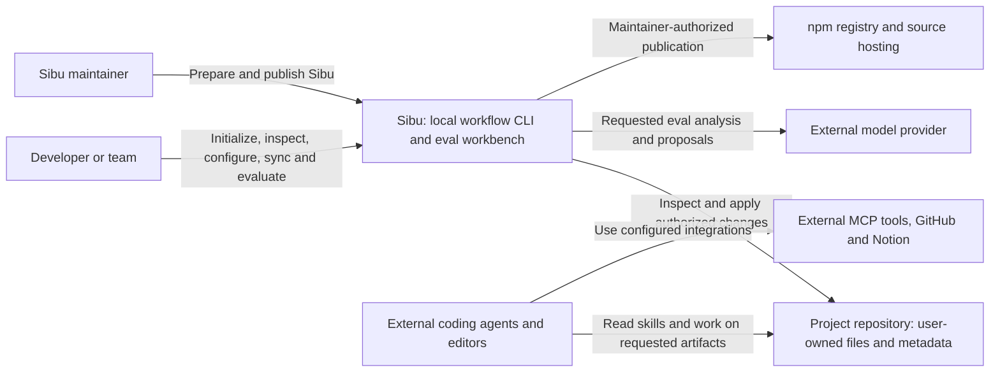
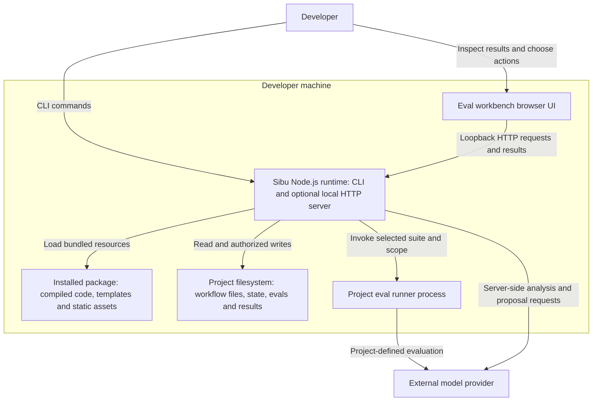
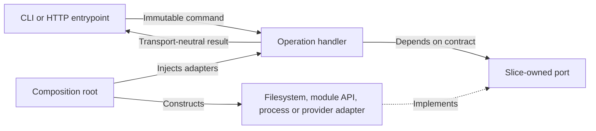
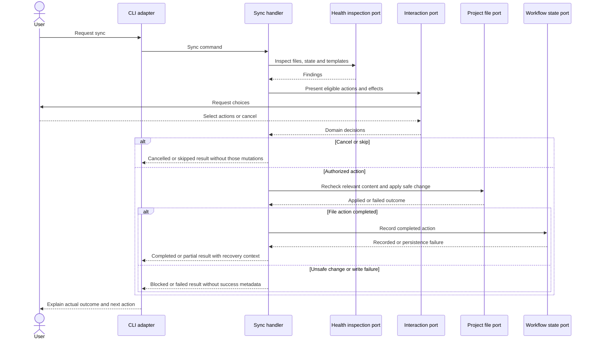
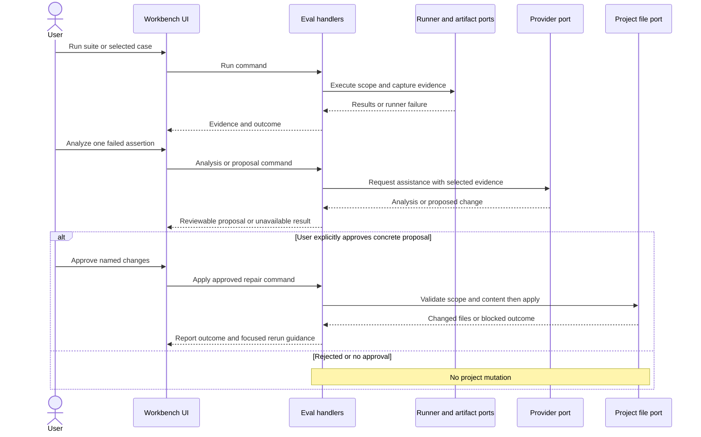

# Sibu Software Architecture Document

## 1. Purpose and architectural authority

This SAD defines Sibu's architectural contract: its system boundaries, deep modules, dependency rules, runtime interactions, and quality constraints. It describes how Sibu is structured, not implementation progress or a migration backlog. Feature SDDs and delivery artifacts carry change-specific designs and execution work.

Business intent comes from the [Product Vision](product-vision.md), vocabulary and rules from the [Business Domain Model](business-domain-model.md), and capability coverage from the [Capabilities Map](capabilities-map.md). This document owns the project building-block view, including deep-module responsibilities; a separate module map is not an additional architectural authority.

Sibu applies the selected [command-pattern guidance](../.agents/skills/command-pattern/SKILL.md): command-oriented vertical slices inside deep modules, with ports and adapters isolating infrastructure. This is Sibu's own architecture. Architecture choices offered to consumer projects do not change Sibu's runtime architecture.

The structure is lean and arc42-based, with C4-style context and container views. It does not claim standards certification. No document approval status or sign-off chain is required. Users choose when to request the next artifact; permissions for code changes, file mutations, and publication remain separate.

## 2. Goals and constraints

| Priority | Architectural consequence |
| --- | --- |
| Protect project ownership | Separate inspection, proposed actions, user choices, mutation, and recorded state. Never treat customization as permission to overwrite. |
| Keep work understandable | Small operation contracts and structured outcomes explain what happened, what did not, and what needs attention. |
| Make behavior testable | Test handlers with fake ports, independently of terminals, filesystems, subprocesses, and providers. |
| Isolate change | Stable module interfaces hide template, agent-format, persistence, eval, and publication complexity. |
| Stay local and lightweight | Deliver a Node.js CLI and optional local workbench, without a hosted backend or mandatory network dependency for local workflow maintenance. |

Sibu is a TypeScript/ES-module application distributed as an npm package. The package runtime baseline is Node.js 20 or later; package metadata governs supported versions. Compiled code, templates, and workbench assets must work from the installed package, without depending on the source checkout.

Sibu is not an IDE, coding agent, model provider, hosted eval platform, or autonomous project manager. External agents execute installed skills; the CLI distributes and maintains their guidance rather than becoming a pipeline execution engine.

## 3. System context

Tool configuration is not execution of the external tool. Feature exports performed by coding agents are distinct from Sibu's maintainer release integrations. Eval runners can also contact external services according to project-owned suite behavior.

## 4. Containers and deployment

The browser application and Node.js runtime are application boundaries, not deep modules. The package resources and project filesystem are storage boundaries, not separate services. The workbench HTTP server runs locally as part of the Sibu runtime; it is not a hosted deployment. Eval runners are external execution boundaries even when launched on the same machine.

The runtime binds the workbench to loopback. Provider credentials remain server-side and are never included in browser assets, responses, managed configuration, or logs. Browser input is untrusted: local deployment does not authorize arbitrary requests or file access.

All nine deep modules live within the application codebase. The Local Evals Workbench additionally owns its browser-facing behavior. Maintainer entrypoints compose release operations separately from public end-user CLI commands. There is no shared remote database or required background daemon. Filesystem state persists independently of a CLI process; stopping the workbench ends its serving lifetime.

## 5. Solution strategy and dependency rules

### Operation contract

Every executable application operation has an explicit immutable **Command**, focused **Handler**, transport-neutral **Result**, and the **Ports** needed for its effects. Read-only operations use the same structure without implying mutation. Pure helpers and value transformations are not separate commands merely because they are functions.

- Entrypoints perform syntactic validation, construct commands, invoke handlers or an application dispatcher, and translate results into terminal or HTTP responses.
- Handlers perform semantic validation and orchestration. They do not import terminal frameworks, access process globals for transport behavior, perform direct filesystem/network/subprocess operations, or construct infrastructure clients.
- Slice-owned ports describe capabilities in application terms. Adapters implement them and translate filesystem, SDK, subprocess, and transport-specific representations at the edge.
- Composition/bootstrap code constructs concrete adapters and injects them into handlers. Request handling does not double as dependency wiring.
- Results describe outcomes such as completion, blocked work, cancellation, and failure. HTTP statuses, CLI exit codes, terminal colors, and prompt objects belong to driving adapters.
- Operational logging is an injected capability following structured-logging guidance, distinct from user-facing presentation.

The diagram shows dependency inversion, not a requirement for asynchronous messaging or a command bus. Direct in-process handler invocation is sufficient.

### Interaction and module collaboration

Interactive workflows separate business choices from prompt mechanics. The handler determines valid choices and safety constraints; an injected interaction capability presents those choices and returns domain selections or cancellation. The terminal adapter owns rendering, input collection, and formatting. HTTP-driven operations can accept explicit choices in commands. Neither route lets the presentation layer decide mutation policy.

Slices live under `src/modules/<module-slug>/<feature-slice>/`, with command, result, handler, and port contracts. Concrete adapters remain outside the handler's dependency core. Their physical placement is an implementation detail; dependency direction is not.

No slice imports another slice's internals. Reusable module behavior is exposed through the owning module's public API. Cross-module effects are consumed through caller-owned ports whose adapters invoke the provider's public API. Shared pure contracts can be public module exports. Shared code is reserved for genuinely universal concepts, not a substitute for ownership.

The dependency structure remains acyclic. In particular, Configuration Manager may consume Health Inspector findings, but it does not invoke Sync Review to repair them; it returns actionable guidance. Health Inspector never calls configuration or sync mutation workflows. Common safety policies belong to the module that owns them, not a reciprocal orchestration dependency.

## 6. Building-block view: deep modules

The stable slugs below identify source ownership, not deployable containers. Interfaces describe outside promises rather than prescribing exact function names.

### Template Catalog — `template-catalog`

- **Interface:** resolve selectable templates, target content, versions, hashes, and meaningful update notes for explicit selections.
- **Owns:** template identity, manifest interpretation, skill and architecture catalogs, agent-specific target resolution, and source-template metadata.
- **Hides:** bundled-resource lookup, catalog validation, target derivation, version/hash rules, and template rendering mechanics.
- **Excludes:** user selection decisions, project-file writes, state persistence, maintenance policy, and agent-tool configuration semantics.
- **Dependencies:** bundled package resources through adapters. No dependency on install, configuration, health, or sync orchestration.

### Agent Tool Configuration — `agent-tool-configuration`

- **Interface:** produce safe agent-specific configuration from selected tool integrations and report unsupported combinations.
- **Owns:** MCP configuration semantics, per-agent shapes, environment-variable references, and credential-safe rendering.
- **Hides:** differences between agent formats and integration requirements.
- **Excludes:** credential storage, external tool execution, workflow selection policy, and project state persistence.
- **Dependencies:** Template Catalog when source content is needed; no dependency on the workflows consuming rendered configuration.

### Workflow State Ledger — `workflow-state-ledger`

- **Interface:** read and validate recorded workflow metadata and persist explicitly requested state changes.
- **Owns:** `.sibu/state.json`, schema interpretation, selected agents/skills/architecture/tools, ownership records, recorded hashes and template versions, and state compatibility.
- **Hides:** state location, serialization, persistence errors, validation, and schema evolution.
- **Excludes:** health judgments, template selection, prompts, sync decisions, and workflow file rendering.
- **Dependencies:** filesystem persistence through ports. It records outcomes but does not authorize them.

### Workflow Installer — `workflow-installer`

- **Interface:** initialize a repo from explicit setup choices while preserving existing files.
- **Owns:** first-time adoption orchestration, required explicit architecture selection without a default, selected-file creation, and initial state recording.
- **Hides:** ordering setup choices, coordinating targets and tool configuration, existing-file handling, and reporting partial or completed adoption.
- **Excludes:** post-init configuration changes, routine drift repair, prompt implementation, and raw state persistence.
- **Dependencies:** Template Catalog, Agent Tool Configuration, Workflow State Ledger, and injected project-file and interaction capabilities.

### Workflow Configuration Manager — `workflow-configuration-manager`

- **Interface:** list options and apply intentional post-init skill, architecture, and tool selection changes safely.
- **Owns:** readiness policy, affected-file scope, selection transitions, architecture-replacement warning/confirmation, and recording successful changes.
- **Hides:** deriving affected targets, reconciling user choices and ownership, and coordinating file/state outcomes.
- **Excludes:** initial adoption, health-finding production, sync repair orchestration, prompt rendering, and raw persistence.
- **Dependencies:** Template Catalog, Agent Tool Configuration, Workflow State Ledger, and Workflow Health Inspector, plus file/interaction ports. Unsafe drift blocks configuration rather than triggering implicit repair.

### Workflow Health Inspector — `workflow-health-inspector`

- **Interface:** return factual, normalized, read-only findings for a project's workflow.
- **Owns:** comparisons between current files, recorded state, and expected templates; missing, modified, unrecorded, outdated, and customized findings; architecture-selection health.
- **Hides:** inspection, hashing, classification, and expected-target comparison.
- **Excludes:** mutation, maintenance action selection, interactive review, and state updates.
- **Dependencies:** Template Catalog, Agent Tool Configuration where expected configuration is needed, Workflow State Ledger, and read-only project inspection ports.

### Sync Review Orchestrator — `sync-review-orchestrator`

- **Interface:** explain maintenance findings, obtain user choices, and apply only authorized maintenance actions.
- **Owns:** mapping findings to allowed actions, protecting customizations, repairing missing architecture selection, and repair/update/customize/unmanage/skip orchestration.
- **Hides:** review sequencing, action eligibility, coordination of content and state changes, and partial-outcome reporting.
- **Excludes:** intentional architecture replacement, first-time adoption, health diagnosis implementation, raw persistence, and generic terminal mechanics.
- **Dependencies:** Workflow Health Inspector, Template Catalog, Agent Tool Configuration, Workflow State Ledger, and file/interaction ports. It does not call Configuration Manager to run a second mutation workflow.

### Local Evals Workbench — `local-evals-workbench`

- **Interface:** discover suites, run selected scope, expose evidence, analyze one failed assertion, propose repairs, and apply explicitly approved changes.
- **Owns:** eval operation slices, workbench view models, result normalization, run artifacts, focused failure context, proposal lifecycle, repair safety policy, and rerun guidance.
- **Hides:** suite conventions, runner invocation, evidence assembly, provider adaptation, proposal validation, root-bound writes, and local-server lifecycle.
- **Excludes:** template distribution, project-specific eval meaning, model quality/billing, workflow drift repair, hosted persistence, and autonomous mutation.
- **Dependencies:** Workflow State Ledger for adoption context and ports for suite discovery, runners, artifacts, model access, project files, clock/logging, and local-server lifecycle. Suite execution and result inspection do not require analysis-provider credentials.

### Maintainer Release Support — `maintainer-release-support`

- **Interface:** plan, validate, and coordinate a maintainer-authorized Sibu release, reporting recovery information after partial failure.
- **Owns:** release-note/version proposals, metadata changes, readiness checks, publication sequencing, and completed-step reporting.
- **Hides:** conventional-commit interpretation, git/tag checks, package validation, interactive publication requirements, and external publication failures.
- **Excludes:** consumer-project release management, public workflow CLI operations, registry/hosting behavior, and general source-control policy.
- **Dependencies:** ports for repository history, metadata files, validation processes, package publication, hosting, interaction, and logging. No dependency on end-user workflow orchestration.

Skill Guidance and the AI-Augmented Development Pipeline are template/prompt-owned capabilities, not additional runtime modules. User Control & Trust is cross-cutting. New deep modules require a distinct outside promise hiding meaningful complexity, not merely another command or technical layer.

## 7. Runtime views

### Safe maintenance

Ports above are logical application boundaries; adapters reach the appropriate public module API or filesystem. Metadata-only choices such as marking a file customized or unmanaged need no content rewrite: state records the selected ownership action after relevant checks. Skipped work is never reported as repaired.

Initialization resolves explicit selections, preserves existing files, creates eligible files, and records actual adoption outcomes. Configuration follows the same safety boundary but first checks readiness and limits changes to the intentional selection request. Doctor inspects and returns findings without writing workflow files or state.

### Eval repair loop

Provider unavailability does not prevent inspection of existing results. Model output is a proposal, never an authorization. A rerun is a distinct user-directed action rather than proof implied by applying a repair.

Maintainer release execution follows the reviewed publication plan. External effects cannot be treated as one filesystem transaction: failures return completed steps and recovery guidance rather than blindly replaying publication.

## 8. Cross-cutting concepts

### Ownership, persistence, and failure safety

Templates are package-owned sources; installed workflow files and generated artifacts belong to the project. Managed, customized, and unmanaged are distinct valid ownership states. Init is one-time adoption, doctor is read-only diagnosis, sync is maintenance, and configuration is an intentional selection change.

Mutation policy stays in the owning handler/domain rules. File adapters enforce safe paths and write mechanics; the ledger owns metadata persistence. Recheck relevant file state before applying a reviewed action so intervening edits cannot silently invalidate the user's choice. Reject unsafe paths, root escapes, and sensitive repair targets, including escapes through symlinks.

Multi-file changes and external publication are not assumed globally atomic. Record completed effects accurately, stop unsafe continuation, and report partial outcomes with affected paths or completed steps. A failed write must not produce metadata claiming that write succeeded. Retrying requires fresh state and must not duplicate irreversible external effects.

### Security and operational visibility

Use environment references rather than embedding secrets in generated tool configuration. Limit provider context to the selected failure's necessary evidence; do not indiscriminately upload repositories. Eval suites execute project code and are not a sandbox for untrusted repositories.

Validate workbench requests at the transport boundary and enforce operation authorization and project scope in handlers. Local HTTP serving must not become an arbitrary filesystem or command-execution interface.

Logs use stable event names, operation identifiers, safe outcomes/reasons, and timing when useful. Do not log credentials, full provider payloads, or sensitive file content. Expected cancellations and blocked choices are distinguishable from unexpected failures. Human-friendly presentation translates results without making operational logs the application contract.

### Workflow documents and templates

The SAD owns system-wide architecture and module boundaries; feature SDDs own compatible operation details and embedded behavior diagrams. Architectural changes route back here, not to silent feature-local redefinition. BRDs remain business-level and independent of SAD authoring; UX precedes SDD work when UI is affected.

Template distribution carries versions and meaningful change notes. Maintenance protects local edits and user review decisions. Prerequisite checks belong in skills; they do not create a document-signature workflow or remove implementation review and mutation permissions.

## 9. Quality verification

| Scenario | Required evidence |
| --- | --- |
| A customized file encounters a template update | Lifecycle tests demonstrate no overwrite without the corresponding user choice and accurate ownership metadata. |
| A handler's infrastructure is unavailable | Fake-port tests cover blocked, cancelled, failed, and partial outcomes without requiring a terminal or real provider. |
| A CLI or HTTP input requests an invalid action | Boundary tests verify syntactic rejection and handler tests verify semantic safety. |
| State changes between review and application | Mutation tests demonstrate safe refusal or renewed review, never silent replacement of intervening edits. |
| An eval repair escapes the project or targets secrets | Path/security tests demonstrate refusal and no unauthorized mutation. |
| A provider is unconfigured or unavailable | Existing evidence remains inspectable, credentials stay server-side, and no repair is implicitly authorized. |
| The package runs outside the source checkout | Packed-runtime validation confirms required code, templates, and static assets are included. |
| A release stops after an external effect | Failure-path tests verify completed-step reporting and safe recovery guidance. |

Validation combines handler unit tests, adapter contract/integration tests, entrypoint tests, and focused lifecycle tests. Use `pnpm verify` for build/type/test checks and `pnpm run validate:packed-runtime` for installed-package behavior. Template changes also require manifest/update-note and lifecycle validation. Passing functional tests alone does not establish dependency compliance: review imports, public boundaries, and composition separately.

## 10. Decisions, tradeoffs, and architectural risks

- **Local modular application, not microservices:** avoids distributed-operation overhead and preserves repo-local ownership; filesystem consistency and process lifecycle need explicit handling.
- **Command-oriented slices inside deep modules:** keeps operation behavior independently testable; avoid unnecessary command wrappers for pure helpers and premature shared ports.
- **Ports at effect boundaries:** reduces framework/provider coupling at the cost of explicit contracts and composition. Keep contracts as small as the caller's needs.
- **Separate adoption, configuration, diagnosis, and maintenance:** protects user intent; public interfaces and acyclic dependencies prevent duplicated safety policy and orchestration loops.
- **Prompt-owned development pipeline:** supports user-directed progression without a hosted workflow engine; skill/template consistency must be validated alongside code.
- **Local eval UI with server-side providers:** supports focused evidence-driven repair without exposing credentials; local HTTP, project-code execution, and model-generated proposals remain trust boundaries.
- **File-backed state and project-owned artifacts:** makes ownership visible and portable; concurrent edits and interrupted writes require revalidation and honest partial-outcome reporting.
- **External publication and model calls:** remain failure-prone and potentially costly; bounded requests, explicit user intent, safe diagnostics, and recovery information protect trust.

These are enduring tradeoffs and failure modes, not an implementation-gap inventory. Feature-specific remediation, sequencing, and completion tracking belong in SDDs and delivery artifacts.

## 11. Diagram validation

The five embedded Mermaid blocks were manually checked for declared nodes/participants, balanced fences and blocks, conservative labels, dependency direction, and meaningful failure paths. Validation is **manual-only; parser/render validation unavailable**. No local `mmdc` executable or Mermaid package was found. No dependencies were installed and no diagrams were uploaded. Rendering has not been verified.
