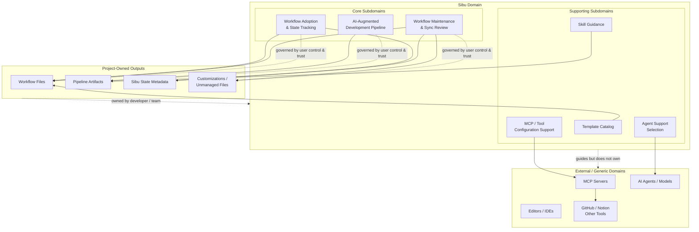

# Business Domain Model

## Document Control & Context

### Executive Summary / Purpose

Sibu helps software engineers and teams adopt, maintain, and use a repo-local AI-augmented development workflow without losing quality, judgment, or ownership.

This model maps the business domain behind Sibu so downstream planning can use consistent language for workflow setup, template maintenance, skill-driven artifact creation, and responsible AI-assisted development.

Sibu's core business problem is not "how to make AI write more code." Its problem is helping developers turn a chaotic, fast-moving AI tooling landscape into a practical, reviewable, human-controlled development loop.

### Domain Scope & Boundaries

This model covers the Sibu product domain: a CLI-guided workflow framework for adopting and maintaining AI-augmented development practices inside a software repo.

Inside this domain:

- repo-local workflow adoption and maintenance
- managed workflow files, templates, drift, and sync review
- skill selection and focused AI workflow guidance
- the AI-Augmented Development Pipeline for planned feature work
- hard-stop prerequisite checks between pipeline artifacts
- small, reviewable AI-assisted work practices
- user control over local edits, customization, and unmanagement

Outside this domain:

- owning the user's editor or IDE
- providing AI models
- acting as a full autonomous coding agent
- replacing engineer judgment, review, or responsibility
- owning the user's product decisions after artifacts are created
- becoming a heavyweight project management system
- guaranteeing implementation quality merely because AI produced output

Sibu may integrate with external tools, agents, editors, model providers, GitHub, Notion, or other services, but those remain external collaborators rather than core Sibu-owned domains.

## Ubiquitous Language

### Terms and Definitions

- **Sibu**: the CLI and workflow framework that helps a repo adopt and maintain an AI-augmented development workflow.
- **Project / Repo**: the local software project where Sibu is adopted.
- **Workflow**: the repo-local AI collaboration setup: instructions, skills, conventions, templates, checks, and operating rules.
- **Workflow Adoption**: the moment a repo starts using Sibu, normally through `sibu init`.
- **Workflow Maintenance**: the ongoing process of checking, reviewing, repairing, updating, customizing, or unmanaging workflow files.
- **Template**: a Sibu-provided source file used to create or update a workflow file.
- **Workflow File**: a project-owned file installed into the repo, even when Sibu still tracks it.
- **Managed File**: a workflow file Sibu tracks and can help keep current.
- **Customized File**: a tracked workflow file with local user edits that Sibu must protect and review carefully.
- **Unmanaged File**: a file the user has taken full ownership of; Sibu no longer controls it.
- **Sibu State Metadata**: recorded workflow metadata such as managed paths, template versions, file hashes, selected agent support, and ownership state.
- **Drift**: a difference between the repo's workflow state and Sibu's known template/state metadata.
- **Template Update**: a newer Sibu-provided version of a managed template.
- **Sync Review**: the user-controlled maintenance process for deciding how to handle drift, missing files, local edits, and template updates.
- **Skill**: focused AI workflow guidance for a specific kind of work or artifact.
- **MCP Server**: an external tool-connection endpoint that lets an AI agent access capabilities such as GitHub, Notion, Gmail, or other services.
- **MCP Selection**: the user's choice to configure one or more MCP servers for supported agents in a project.
- **MCP Configuration**: repo-local agent configuration that tells an agent how to connect to selected MCP servers without embedding secrets.
- **Artifact**: a project-owned document or plan produced by a skill and used as input for later work.
- **AI-Augmented Development Pipeline**: the ordered artifact chain used for planned product and feature work.
- **Hard Stop**: a skill refusal to proceed when required prerequisite artifacts or decisions are missing.
- **Small Work Loop**: Sibu's preferred development behavior: define a focused task, inspect context, plan, confirm scope, change, validate, and review.
- **User Control**: the invariant that the user chooses whether to accept, reject, customize, or unmanage Sibu-guided changes.

### Synonym Clarification

- **Template vs Workflow File**: a template is Sibu-provided source; a workflow file is the repo-local, project-owned copy created from a template.
- **Managed vs Owned**: Sibu may manage a file, but ownership remains with the project/user. "Managed" never means "Sibu may silently overwrite it."
- **Customized vs Drifted**: customization is user-owned change that may be valid; drift is a detected difference that needs review. Not all drift is a mistake.
- **Workflow vs Pipeline**: workflow is the overall repo-local AI collaboration setup. Pipeline is the ordered artifact chain used for planned product/feature work.
- **Skill vs Artifact**: a skill is the guidance/process; an artifact is the project-owned output produced by that skill.
- **MCP Server vs Skill**: an MCP server provides external tool access; a skill provides workflow guidance. A skill may tell an agent when or how to use a tool, but it is not the tool itself.
- **MCP Configuration vs Credentials**: Sibu may render configuration that references credential environment variables, but Sibu should not store or embed secrets.
- **Guide vs Autopilot**: Sibu guides developers into better AI collaboration; it does not replace the developer or run the whole project unattended.
- **Sync vs Init**: `sibu init` is one-time adoption. `sibu sync` is ongoing maintenance. Re-running init is not the normal update path.

## Bounded Contexts & Subdomains

### Subdomains

#### Core Subdomains

- **Workflow Adoption & State Tracking**: establishes Sibu in a repo and records what Sibu manages.
- **Workflow Maintenance & Sync Review**: detects drift and helps users review, repair, update, customize, skip, or unmanage workflow files.
- **AI-Augmented Development Pipeline**: enforces the artifact chain for planned feature/product work so downstream AI work stays grounded in upstream decisions.

#### Supporting Subdomains

- **Template Catalog**: provides Sibu-managed source templates for workflow files and skills.
- **Skill Guidance**: supplies focused workflows for product vision, business domain modeling, deep module mapping, feature briefs, technical design, Scrum planning, implementation planning, and execution.
- **Agent Support Selection**: helps choose which agent support files and configurations belong in a project.
- **MCP / Tool Configuration Support**: helps users select optional MCP servers, renders agent-specific configuration, and keeps external tool access separate from stored credentials.

#### Generic / External Subdomains

- **Source Control Hosting**: external systems such as GitHub may hold issues, PRs, and repositories.
- **Documentation Workspaces**: external systems such as Notion may receive exported artifacts.
- **MCP Servers**: external tool-access endpoints that agents may connect to when the user selects them.
- **AI Models and Coding Agents**: external providers and tools that execute or assist with AI work.
- **Editors / IDEs**: external development surfaces where engineers work.

#### Cross-Cutting Principle

- **User Control & Trust**: not a standalone subdomain, but a governing product principle expressed through concrete capabilities in each subdomain. Adoption must make project ownership clear. Maintenance must protect local edits and require sync review decisions. The pipeline must preserve artifact review gates and hard-stop on missing context. Tool configuration must avoid storing secrets. Across the domain, Sibu keeps the engineer responsible for direction and judgment.

### Context Map



This map emphasizes Sibu's subdomains rather than every operational relationship. Core subdomains define Sibu's main business value; supporting subdomains provide reusable workflow assets and optional integration setup. User Control & Trust governs the core workflows as a cross-cutting principle rather than a separate subdomain. Project-owned outputs remain under developer/team ownership, while MCP servers, agents, editors, and external tools stay outside Sibu's core domain.

## Domain Concepts & Conceptual Diagram

### Conceptual Entities / Objects

#### Project / Repo

The local software project where Sibu is adopted. It contains workflow files and Sibu state metadata.

#### Workflow

The repo-local AI collaboration environment. It includes agent instructions, skills, conventions, safety rules, templates, checks, and operating practices.

#### Template

A Sibu-provided source file that can create or update a workflow file. Templates are versioned by Sibu.

#### Workflow File

A project-owned file installed into the repo. It may be managed, customized, or unmanaged.

#### File Ownership State

The business state describing Sibu's relationship to a workflow file:

- managed
- customized
- unmanaged

#### Sibu State Metadata

The record of what Sibu believes it manages: template versions, paths, hashes, selected agent support, and ownership state.

#### Drift

A detected mismatch between current repo state and Sibu's recorded or expected workflow state.

#### Sync Review

The decision process where the user chooses what to do about drift, missing files, local edits, and template updates.

#### Skill

A focused unit of AI workflow guidance for one type of work. Skills are responsible for routing, prerequisites, behavior, and output expectations.

#### MCP Server

An external tool-access endpoint selected by the user and configured for supported agents. MCP servers are optional integrations, not Sibu-owned workflow logic.

#### Artifact

A project-owned output created or updated by a skill. Examples include Product Vision, Business Domain Model, Deep Module Map, Feature Brief, Technical Design, Epics, User Stories, and implementation plans.

#### AI-Augmented Development Pipeline

The ordered artifact chain used for planned feature/product work:

```text
Product Vision
→ Business Domain Model
→ Deep Module Map / Feature Brief
→ Technical Design
→ optional UX
→ Epics / User Stories
→ AI Implementation Planning / Execution
```

#### Hard Stop

A skill-level refusal to continue when required upstream artifacts, decisions, or context are missing.

#### Small Work Loop

The preferred collaboration pattern for AI-assisted work:

```text
define focused task
→ inspect repo context
→ propose plan
→ confirm scope
→ make change
→ validate
→ summarize/review
```

### Attributes / Characteristics

- A **Project / Repo** has workflow files, Sibu state metadata, selected agent support, and local user changes.
- A **Template** has a path, version, description, and user-facing change notes.
- A **Workflow File** has a repo path, source template, current content, recorded hash, template version, and ownership state.
- **Sibu State Metadata** records managed paths, template versions, file hashes, selected agent support, and whether files are managed, customized, or unmanaged.
- A **Skill** has a purpose, trigger scope, required inputs, hard-stop conditions, owned output artifact, and boundaries.
- An **MCP Configuration** has a selected server, target agent, connection metadata, and references to credential environment variables when needed.
- An **Artifact** has a path, purpose, source context, review state, and downstream consumers.
- A **Sync Review** has detected conditions, user choices, applied actions, skipped actions, and updated state.

### Relationships & Cardinality

- A **Project / Repo** can adopt **one Sibu Workflow**.
- A **Workflow** contains many **Workflow Files**.
- A **Template** can generate or update many repo-local **Workflow Files** across different projects.
- A **Workflow File** is generated from zero or one known **Template**. Some user-owned files may be unmanaged and no longer tied to a template.
- A **Workflow File** has exactly one current **File Ownership State**.
- A **Project / Repo** has one **Sibu State Metadata** record when initialized.
- **Sibu State Metadata** tracks many managed or customized **Workflow Files**.
- A **Drift** finding refers to one workflow file or one workflow-level state mismatch.
- A **Sync Review** can resolve, defer, or record many drift findings.
- A **Skill** produces or updates one primary **Artifact** type.
- A **Skill** may guide use of an MCP-provided tool, but the MCP server remains an external integration.
- An **Artifact** can be required by one or more downstream **Skills**.
- The **AI-Augmented Development Pipeline** orders many artifacts so each layer of decision-making supports the next.
- A **Hard Stop** belongs to a skill and protects one or more prerequisite requirements.

## Domain Invariants & Business Rules

### Invariants

- The user is always in control.
- Sibu must not silently overwrite local edits.
- Sibu must not take destructive actions unless explicitly requested or confirmed by the user.
- A template is Sibu-provided source; an installed workflow file is project-owned.
- Managed does not mean Sibu owns the file more than the user does.
- `sibu init` is for one-time adoption, not routine updates.
- `sibu doctor` is read-only and must not change workflow files.
- `sibu sync` is the maintenance path for reviewing and applying workflow changes after initialization.
- Sibu must protect customized files from automatic overwrite.
- Sibu should make drift understandable rather than hide it.
- Users can customize or unmanage workflow files when Sibu defaults no longer fit.
- MCP integrations are optional and user-selected.
- Sibu must not commit, store, or embed secrets in generated MCP configuration.
- Feature/product planning work must follow the enforced artifact pipeline when it triggers the relevant skills.
- Each pipeline skill owns a specific artifact and should not write unrelated downstream artifacts.
- Each pipeline skill must hard-stop when required upstream artifacts are missing or insufficient.
- Narrow fixes and normal repo work do not require the full product pipeline unless the work creates product, domain, feature, architecture, planning, or implementation-plan ambiguity.
- AI-assisted work should be small, explicit, validated where possible, and reviewable by the engineer.
- Sibu should amplify engineering judgment, not replace it.

### Policies

- When a repo has no Sibu workflow, `sibu init` may bootstrap the initial workflow and record state metadata.
- When workflow health is uncertain, `sibu doctor` should inspect state and report whether the workflow is healthy or needs review.
- When drift, missing files, local edits, or template updates are detected, Sibu should direct the user to `sibu sync`.
- When local edits exist, Sibu should present review options instead of overwriting automatically.
- When a managed file is missing, Sibu may offer to repair it during sync.
- When an MCP server is selected, Sibu should render agent-specific configuration that references credentials safely rather than storing secret values.
- When a template update exists, Sibu should explain the meaningful change before the user decides whether to apply it.
- When the user wants local ownership, Sibu should allow a file to become customized or unmanaged.
- When planned feature work triggers a downstream skill without prerequisites, that skill should hard-stop and identify the missing upstream artifact.
- When a skill produces an artifact, that artifact should clarify one layer of decision-making before downstream work starts.
- When a user requests a narrow fix, Sibu guidance should avoid unnecessary pipeline ceremony unless scope or ownership is unclear.

## Domain Events & Behaviors

### Key Lifecycle Triggers

#### Project Workflow Lifecycle

1. **Uninitialized Repo**: the repo has no Sibu workflow metadata.
2. **Initialized Workflow**: `sibu init` has created initial workflow files and state metadata.
3. **Healthy Workflow**: managed files match known state and no drift is detected.
4. **Drifted Workflow**: files are missing, modified, unrecorded, customized, or generated from older templates.
5. **Sync Review Needed**: the user must decide how to handle detected drift or updates.
6. **Maintained Workflow**: sync decisions have been applied, skipped, or recorded.
7. **Partially User-Owned Workflow**: some files may become customized or unmanaged while the rest remain managed.

#### Workflow File Lifecycle

1. **Template Available**: Sibu has a template source.
2. **File Installed**: the template is copied into the project as a workflow file.
3. **Managed**: Sibu tracks and can help update the file.
4. **Customized**: user edits exist and must be protected.
5. **Reviewed**: user has reviewed local customization or template changes.
6. **Updated / Repaired / Skipped**: user chooses how to handle the file during sync.
7. **Unmanaged**: user takes full ownership and Sibu stops controlling it.

#### AI-Augmented Development Artifact Lifecycle

1. **Prerequisite Artifact Exists**: upstream artifact is present and sufficient.
2. **Skill Invoked**: the appropriate skill is triggered for the requested work.
3. **Hard-Stop Check**: the skill verifies required inputs before proceeding.
4. **Artifact Created or Updated**: the skill produces its owned artifact.
5. **Artifact Reviewed / Approved**: the user confirms or corrects the artifact as needed.
6. **Downstream Input**: the artifact becomes the basis for the next pipeline stage.

### Domain Events

- **Workflow Initialized**: a repo adopts Sibu and records initial workflow metadata.
- **Workflow Health Checked**: Sibu inspects workflow state without changing files.
- **Drift Detected**: Sibu finds missing, modified, unrecorded, customized, or outdated workflow files.
- **Template Update Available**: a newer Sibu template exists for a tracked workflow file.
- **Local Customization Detected**: a workflow file has user edits that must be protected.
- **Managed File Repaired**: a missing or broken managed file is restored by user choice.
- **Template Update Applied**: the user chooses to apply a template update.
- **File Marked Customized**: the user keeps local edits while Sibu records them as reviewed/customized.
- **File Marked Unmanaged**: the user takes full ownership and Sibu stops controlling the file.
- **Sync Review Completed**: user decisions from a sync session are applied or recorded.
- **Skill Invoked**: a user request triggers a focused Sibu skill.
- **Prerequisite Missing**: a skill hard-stops because required upstream artifacts are absent or insufficient.
- **Artifact Created**: a skill creates its owned artifact.
- **Artifact Updated**: a skill revises its owned artifact.
- **Artifact Accepted for Downstream Work**: an artifact is clear enough to serve as input for the next pipeline stage.
- **Implementation Plan Ready**: a user story has enough planning detail for AI-assisted execution.

## Out of Scope & Future Evolution

### Assumptions

- Sibu is primarily a CLI companion for engineers and teams working inside software repositories.
- Sibu's strongest product value comes from reliable workflow setup, maintenance, and responsible AI collaboration patterns.
- The AI-Augmented Development Pipeline is enforced for planned product/feature work when the relevant skills are triggered.
- Normal repo work and narrow fixes should stay lightweight and do not require the full pipeline by default.
- Users want strong defaults, but they also need local control over languages, frameworks, agents, architecture guidance, and managed files.
- Installed workflow files are always project-owned, even when Sibu tracks them.
- Template update notes should be understandable to users reviewing sync decisions.
- The quality signal is not that AI completed work; it is that the engineer is proud to ship the result.

### Known Variations / Debt

- **Guidance vs control**: Sibu must be opinionated enough to improve quality but flexible enough to let users take ownership.
- **Automation vs trust**: Sibu should reduce tedious setup and maintenance work without hiding changes or overriding local decisions.
- **Strong defaults vs local adaptation**: defaults should help most users move quickly, while customization and unmanagement remain first-class paths.
- **Pipeline enforcement vs developer flow**: feature work should follow the artifact chain, but narrow fixes should not be burdened with unnecessary process.
- **Template freshness vs local edits**: newer templates may be valuable, but customized local files require careful review and protection.
- **AI speed vs engineering pride**: Sibu should help users move faster while preserving clean code, maintainability, reviewability, and human ownership.
- **Skill boundaries**: each skill must stay focused on its owned artifact while still handing off enough context to downstream skills.
- **External tool evolution**: agents, models, editors, MCP servers, and collaboration tools will keep changing, so Sibu must avoid hard-coding its business identity around any single external tool.
