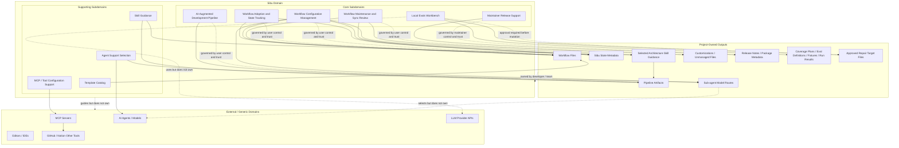

# Business Domain Model

## Document Control & Context

### Executive Summary / Purpose

Sibu helps software engineers and teams adopt, maintain, and use a repo-local AI-augmented development workflow without losing quality, judgment, or ownership.

This model maps the business domain behind Sibu so downstream planning can use consistent language for workflow setup, template maintenance, skill-driven artifact creation, and responsible AI-assisted development.

Sibu's core business problem is not "how to make AI write more code." Its problem is helping developers turn a chaotic, fast-moving AI tooling landscape into a practical, reviewable, human-controlled development loop.

### Domain Scope & Boundaries

This model covers the Sibu product domain: a CLI-guided workflow framework for adopting and maintaining AI-augmented development practices inside a software repo.

Inside this domain:

- repo-local workflow adoption and maintenance
- managed workflow files, templates, drift, and sync review
- repo-local AI integration discovery, eval coverage planning, suite authoring, execution, failure analysis, repair proposal review, and approval-gated project file mutation
- skill selection and focused AI workflow guidance
- repo-wide model routing for Sibu-provided sub-agent roles
- required architecture skill selection from Sibu's fixed catalog
- the AI-Augmented Development Pipeline for planned feature work
- hard-stop prerequisite checks between pipeline artifacts
- small, reviewable AI-assisted work practices
- bounded, sequential story-branch execution through checked tasks and automatically advanced milestones, with human stops for material decisions and final epic review
- user control over local edits, customization, and unmanagement

Outside this domain:

- owning the user's editor or IDE
- providing AI models
- acting as a full autonomous coding agent
- handling production deployment or feature rollout
- replacing engineer judgment, review, or responsibility
- owning the user's product decisions after artifacts are created
- becoming a heavyweight project management system
- becoming a hosted eval service, benchmark platform, or autonomous optimization engine
- guaranteeing implementation quality merely because AI produced output

Sibu may integrate with external tools, agents, editors, model providers, GitHub, Notion, or other services, but those remain external collaborators rather than core Sibu-owned domains.

## Ubiquitous Language

### Terms and Definitions

- **Sibu**: the CLI and workflow framework that helps a repo adopt and maintain an AI-augmented development workflow.
- **Project / Repo**: the local software project where Sibu is adopted.
- **Workflow**: the repo-local AI collaboration setup: instructions, skills, conventions, templates, checks, and operating rules.
- **Workflow Adoption**: the moment a repo starts using Sibu, normally through `sibu init`.
- **Workflow Maintenance**: the ongoing process of checking, reviewing, repairing, updating, customizing, or unmanaging workflow files.
- **Template**: a Sibu-provided source file used to create or update a workflow file.
- **Workflow File**: a project-owned file installed into the repo, even when Sibu still tracks it.
- **Managed File**: a workflow file Sibu tracks and can help keep current.
- **Customized File**: a tracked workflow file with local user edits that Sibu must protect and review carefully.
- **Unmanaged File**: a file the user has taken full ownership of; Sibu no longer controls it.
- **Sibu State Metadata**: recorded workflow metadata such as managed paths, template versions, file hashes, selected agent support, and ownership state.
- **Drift**: a difference between the repo's workflow state and Sibu's known template/state metadata.
- **Template Update**: a newer Sibu-provided version of a managed template.
- **Sync Review**: the user-controlled maintenance process for deciding how to handle drift, missing files, local edits, and template updates.
- **Skill**: focused AI workflow guidance for a specific kind of work or artifact.
- **Architecture Skill**: a focused skill from Sibu's fixed architecture catalog that gives architecture-specific guidance for how project architecture, feature design, implementation planning, and execution should be shaped.
- **Selected Architecture Skill**: the one repo-level architecture skill the user explicitly chooses during workflow adoption. It is recorded in Sibu state, installed as workflow guidance, and carried into downstream technical and implementation work.
- **Architecture Skill Replacement**: an intentional high-impact workflow configuration change where the user replaces the selected architecture skill with a different catalog option after initialization.
- **MCP Server**: an external tool-connection endpoint that lets an AI agent access capabilities such as GitHub, Notion, Gmail, or other services.
- **MCP Selection**: the user's choice to configure one or more MCP servers for supported agents in a project.
- **MCP Configuration**: repo-local agent configuration that tells an agent how to connect to selected MCP servers without embedding secrets.
- **Sibu-Provided Sub-agent Role**: a named delegated role distributed by Sibu, such as an implementation planner, executor, or specialist reviewer. User-created agents remain outside Sibu's model-routing responsibility.
- **Workload Class**: a provider-neutral description of the scope, ambiguity, and risk of work delegated to a Sibu-provided sub-agent role. It supports recommendations without naming a provider model.
- **Model Route**: the repo-wide, user-selected model and reasoning-effort choice for one Sibu-provided sub-agent role, workload class, and supported agent environment.
- **Provider Mapping**: the translation from a provider-neutral workload class and sub-agent role to a concrete model and reasoning-effort recommendation for one supported agent environment.
- **Model Recommendation Catalog**: Sibu's versioned, research-informed set of provider mappings, based on current official guidance, provider information, and maintainer judgment. It is updated through Sibu releases and reviewed through sync rather than discovered or applied silently at runtime.
- **Recommended Model Route**: the current catalog-backed model route Sibu proposes as the best expected fit for a role and workload class, considering expected quality first, cost second, and completion time third without guaranteeing outcomes.
- **User-Selected Model Route**: a route the user chooses instead of Sibu's current recommendation. It remains fully supported as a user choice and is clearly distinguished from a Sibu recommendation.
- **Model Route Review**: the user-controlled decision to select, retain, replace, or reset a role-and-workload model route after first use, unavailability, or a catalog update.
- **Artifact**: a project-owned document or plan produced by a skill and used as input for later work.
- **Local Eval Artifact**: a project-owned eval definition, test case, fixture, prompt reference, assertion, grader, expected/reference output, or run result used by the Local Evals Workbench.
- **Evaluation Target**: a repo-local generative-AI integration, agent, prompt, or AI-assisted workflow whose behavior the user wants to evaluate.
- **Eval Coverage Plan**: a user-reviewed proposal describing which confirmed Evaluation Targets, behavior categories, risks, and scenarios an eval suite will cover before suite artifacts are generated.
- **Coverage Gap**: an applicable behavior category, risk, or scenario that is not covered, together with the reason it remains uncovered.
- **Eval Suite**: a repo-local collection of related eval test cases, assertions/graders, fixtures, and run behavior discovered through Sibu's eval conventions.
- **Eval Test Case**: one single-turn or multi-turn scenario inside an eval suite that can be run by itself or as part of the whole suite.
- **Tool Interaction Expectation**: the expected tool selection, arguments, sequence, result handling, or failure behavior for an Evaluation Target, evaluated without invoking real external side effects in the initial scope.
- **Model Under Evaluation**: the single compatible model selected by the user to produce behavior during an Eval Run.
- **Judge Model**: the separately selected model that evaluates rubric-based criteria when deterministic assertions are insufficient.
- **Assertion / Grader**: the rule, rubric, or evaluator that judges a test case output. Assertions are deterministic or declared checks; graders may include rubric or LLM-judged checks.
- **Eval Run**: one execution of an eval suite or one selected eval test case against a single Model Under Evaluation; each selected case runs once.
- **Eval Result**: the output, assertion/grader outcomes, diagnostics, metrics, and artifacts produced by an eval run.
- **Failed Assertion**: one assertion or grader outcome that did not pass for a specific test case result.
- **Failure Analysis**: a user-requested LLM explanation of one failed assertion at a time, grounded in the exact output, expected/reference context, and assertion/grader evidence.
- **Repair Proposal**: a concrete suggested project file mutation intended to address a failed assertion, including affected file(s), rationale, and expected eval impact.
- **Approved Eval Repair**: a repair proposal the user explicitly accepts before Sibu mutates any project file.
- **AI-Augmented Development Pipeline**: the ordered artifact chain used for planned product and feature work.
- **Story Implementation Plan**: the story-local ordered decomposition of one deployable User Story into one or more outcome-grouped Milestones and objectively checked Tasks.
- **Milestone**: a reviewable outcome grouping one or more Tasks; every User Story has at least one, and earlier Milestones advance automatically after verification.
- **Task**: one bounded, meaningful implementation outcome executed in one fresh agent run with a planner-specified, executable pass/fail check and a task-specific commit after it passes.
- **Task Check**: the objective, mechanical pass/fail evidence defined by the planner for one Task before execution; the executor runs it but does not invent it.
- **Plan Review Cycle**: architecture review of the current plan followed by automatic acceptance when no findings or unresolved risks exist; actionable findings prompt plan revision and fresh review, while unresolved material decisions stop for the human.
- **Architecture Review**: independent, read-only assessment of the implementation plan, prioritizing over-engineering and premature optimization alongside architecture fit, scope, task sizing, and Task Checks; it does not review code.
- **Review Packet**: evidence-based findings and outcome returned by the architecture reviewer for one exact plan version.
- **Review Presentation**: the main agent's short, plain-language explanation of the plan review findings, proposed fixes, and unresolved risks for human decision.
- **Human Plan Decision**: when a material finding or risk cannot be resolved safely through revision, the user's choice to accept the current reviewed plan, request changes, or defer it; accepted unresolved warnings remain visible.
- **Epic Branch**: the integration branch for one Epic, created before its Stories and updated by their sequentially merged work.
- **Story Branch**: the isolated branch for one User Story, created from the current Epic Branch and receiving checked Task commits before its Story Pull Request.
- **Progress Log**: compact task-by-task execution history, including outcome, commit reference, decisions, gotchas, and blockers for later fresh-context runs.
- **Story Pull Request**: the traceable integration record for one completed Story, merged without routine human review into its Epic Branch only after required checks and evidence pass.
- **Epic Pull Request**: the final human review surface for one completed Epic; it links the merged Story Pull Requests and summarizes all completed work, verification, and noteworthy blockers or recoveries.
- **Hard Stop**: a skill refusal to proceed when required prerequisite artifacts or decisions are missing.
- **Small Work Loop**: Sibu's preferred development behavior: define a focused task, inspect context, plan its scope and checks, change, validate, and record the checked outcome for final Epic review.
- **User Control**: the invariant that the user chooses whether to accept, reject, customize, or unmanage Sibu-guided changes.

### Synonym Clarification

- **Template vs Workflow File**: a template is Sibu-provided source; a workflow file is the repo-local, project-owned copy created from a template.
- **Managed vs Owned**: Sibu may manage a file, but ownership remains with the project/user. "Managed" never means "Sibu may silently overwrite it."
- **Customized vs Drifted**: customization is user-owned change that may be valid; drift is a detected difference that needs review. Not all drift is a mistake.
- **Workflow vs Pipeline**: workflow is the overall repo-local AI collaboration setup. Pipeline is the ordered artifact chain used for planned product/feature work.
- **Skill vs Artifact**: a skill is the guidance/process; an artifact is the project-owned output produced by that skill.
- **Eval Suite vs Eval Run**: a suite defines what can be evaluated; a run is one execution of that suite or one test case from it.
- **Model Under Evaluation vs Judge Model**: the Model Under Evaluation produces the behavior being tested; the Judge Model scores rubric-based behavior and must remain distinguishable in results.
- **Assertion vs Grader**: assertion is the familiar UI term for checks; grader is the broader eval term for rubric or model-judged evaluation.
- **Analysis vs Proposal vs Mutation**: analysis explains evidence, a proposal previews a concrete change, and mutation changes project files only after explicit user approval.
- **Plan Review vs Epic Review**: the architecture specialist inspects each Story plan before execution; the human reviews integrated work through the final Epic Pull Request. Story and earlier Milestone transitions do not require routine human approval. The architecture reviewer does not review code.
- **Specialist Outcome vs Plan Acceptance**: a complete review with no findings or unresolved risks permits automatic acceptance of its exact plan; actionable findings trigger revision and fresh review, while unresolved material decisions require human choice.
- **Task vs User Story**: Tasks are fresh-context execution units; User Stories are deployable slices whose acceptance criteria govern the plan.
- **Architecture Skill vs Architecture Model**: users may think in terms of an architecture model, but Sibu expresses that choice as a selected architecture skill from its fixed catalog. This feature does not define or expand the catalog.
- **Required Selection vs Default Choice**: requiring a user to choose an architecture skill is not the same as Sibu choosing one by default. The user must make the explicit choice.
- **MCP Server vs Skill**: an MCP server provides external tool access; a skill provides workflow guidance. A skill may tell an agent when or how to use a tool, but it is not the tool itself.
- **MCP Configuration vs Credentials**: Sibu may render configuration that references credential environment variables, but Sibu should not store or embed secrets.
- **Workload Class vs Model Route**: a workload class describes delegated work in provider-neutral terms; a model route records the concrete user choice for one role, workload class, and supported agent environment.
- **Recommended vs Required Model**: a recommended model is Sibu's current research-informed suggestion for a role and workload class. It is never an allowlist entry, a quality guarantee, or a mandatory choice; users may select another available model.
- **Unavailable vs User-Selected Model**: unavailable means the selected agent environment cannot use the saved route; user-selected means the user chose it instead of Sibu's current recommendation. A user-selected route may still be available and valid.
- **Guided Unattended Progress vs Autopilot**: Sibu advances a well-defined Epic without routine Story review, but does not replace the developer, conceal failures, or make material decisions for them.
- **Sync vs Init**: `sibu init` is one-time adoption. `sibu sync` is ongoing maintenance. Re-running init is not the normal update path.

## Bounded Contexts & Subdomains

### Subdomains

#### Core Subdomains

- **Workflow Adoption & State Tracking**: establishes Sibu in a repo and records what Sibu manages, including the required selected architecture skill.
- **Workflow Configuration Management**: lets users intentionally change selected workflow guidance, architecture guidance, tool integrations, and repo-wide sub-agent model routes after initialization while preserving safety and state consistency.
- **Workflow Maintenance & Sync Review**: detects drift and helps users review, repair, update, customize, skip, or unmanage workflow files.
- **AI-Augmented Development Pipeline**: enforces the artifact chain for planned feature/product work, selected architecture guidance, reviewed story plans, bounded checked execution, human decisions on material blockers, sequential Story PR integration, and final Epic PR review.
- **Local Evals Workbench**: helps users discover Evaluation Targets, approve deep risk-based coverage, create repo-local eval suites, run all or one test case against a selected compatible model, inspect results, analyze one failed assertion at a time, review concrete repair proposals, approve project file mutations, and rerun eval scope.
- **Maintainer Release Support**: helps Sibu maintainers prepare, validate, publish, and recover Sibu releases without turning release automation into an end-user workflow.

#### Supporting Subdomains

- **Template Catalog**: provides Sibu-managed source templates for workflow files and skills.
- **Skill Guidance**: supplies focused workflows for product vision, business domain modeling, project-level software architecture documents, BRDs, per-feature software design documents, Scrum planning, implementation planning, execution, selected architecture guidance, and eval authoring.
- **Agent Support Selection**: helps choose which agent support files and configurations belong in a project and maintains explicit, repo-wide model routes for Sibu-provided sub-agent roles.
- **MCP / Tool Configuration Support**: helps users select optional MCP servers, renders agent-specific configuration, and keeps external tool access separate from stored credentials.

#### Generic / External Subdomains

- **Source Control Hosting**: external systems such as GitHub may hold issues, PRs, and repositories.
- **Documentation Workspaces**: external systems such as Notion may receive exported artifacts.
- **MCP Servers**: external tool-access endpoints that agents may connect to when the user selects them.
- **AI Models and Coding Agents**: external providers and tools that execute or assist with AI work.
- **Editors / IDEs**: external development surfaces where engineers work.

#### Cross-Cutting Principle

- **User Control & Trust**: not a standalone subdomain, but a governing product principle expressed through concrete capabilities in each subdomain. Adoption must make project ownership clear. Maintenance must protect local edits and require sync review decisions. The pipeline must preserve artifact review gates, hard-stop on missing context, apply selected architecture guidance, automatically accept only complete risk-free plan reviews, require human decisions on unresolved material blockers and final Epic PR review, and prevent executors from inventing scope or checks. Local eval repair must separate analysis, proposal, approval, mutation, and rerun. Tool configuration must avoid storing secrets. Across the domain, Sibu keeps the engineer responsible for direction and judgment.

### Context Map


```mermaid
flowchart TB
  subgraph SibuDomain ["Sibu Domain"]
    direction TB

    subgraph Core ["Core Subdomains"]
      Adoption["Workflow Adoption and State Tracking"]
      Configuration["Workflow Configuration Management"]
      Maintenance["Workflow Maintenance and Sync Review"]
      Pipeline["AI-Augmented Development Pipeline"]
      LocalEvals["Local Evals Workbench"]
      ReleaseSupport["Maintainer Release Support"]
    end

    subgraph Supporting ["Supporting Subdomains"]
      Templates["Template Catalog"]
      Skills["Skill Guidance"]
      AgentSupport["Agent Support Selection"]
      McpConfig["MCP / Tool Configuration Support"]
    end
  end

  subgraph ProjectOwned ["Project-Owned Outputs"]
    WorkflowFiles["Workflow Files"]
    Artifacts["Pipeline Artifacts"]
    State["Sibu State Metadata"]
    ModelRoutes["Sub-agent Model Routes"]
    ArchitectureGuidance["Selected Architecture Skill Guidance"]
    LocalChoices["Customizations / Unmanaged Files"]
    ReleaseArtifacts["Release Notes / Package Metadata"]
    EvalArtifacts["Coverage Plans / Eval Definitions / Fixtures / Run Results"]
    ProjectFiles["Approved Repair Target Files"]
  end

  subgraph External ["External / Generic Domains"]
    McpServers["MCP Servers"]
    AiAgents["AI Agents / Models"]
    ModelProviders["LLM Provider APIs"]
    Editors["Editors / IDEs"]
    Tools["GitHub / Notion Other Tools"]
  end

  Adoption --> State
  Adoption --> WorkflowFiles
  Configuration --> WorkflowFiles
  Configuration --> State
  Configuration --> ModelRoutes
  Configuration --> ArchitectureGuidance
  Maintenance --> WorkflowFiles
  Maintenance --> State
  Maintenance --> LocalChoices
  Pipeline --> Artifacts
  LocalEvals --> EvalArtifacts
  LocalEvals --> ProjectFiles
  ArchitectureGuidance --> Artifacts
  ReleaseSupport --> ReleaseArtifacts
  Adoption -. "governed by user control and trust" .-> WorkflowFiles
  Configuration -. "governed by user control and trust" .-> WorkflowFiles
  Maintenance -. "governed by user control and trust" .-> LocalChoices
  Pipeline -. "governed by user control and trust" .-> Artifacts
  LocalEvals -. "approval required before mutation" .-> ProjectFiles
  ReleaseSupport -. "governed by maintainer control and trust" .-> ReleaseArtifacts

  Templates --> WorkflowFiles
  Skills --> Artifacts
  Skills --> ArchitectureGuidance
  AgentSupport --> AiAgents
  AgentSupport --> ModelRoutes
  ModelRoutes -. "selects but does not own" .-> AiAgents
  McpConfig --> McpServers
  LocalEvals -. "uses but does not own" .-> ModelProviders
  McpServers --> Tools

  SibuDomain -. "guides but does not own" .-> External
  ProjectOwned -. "owned by developer / team" .-> SibuDomain
```

This map emphasizes Sibu's subdomains rather than every operational relationship. Core subdomains define Sibu's main business value; supporting subdomains provide reusable workflow assets and optional integration setup. Workflow Configuration Management is distinct from first-time adoption and maintenance: it handles intentional post-init changes rather than initial setup or drift repair. Repo-wide sub-agent model routes are project-owned configuration for Sibu-provided roles; the external models and coding agents remain outside Sibu's domain. Architecture skill selection is required at adoption time, and architecture skill replacement is a high-impact configuration change rather than ordinary drift repair. Maintainer Release Support is also core, but maintainer-facing: it protects Sibu's own release process rather than a consumer project's installed workflow. User Control & Trust governs the core workflows as a cross-cutting principle rather than a separate subdomain. Project-owned outputs remain under developer/team ownership, while MCP servers, agents, editors, and external tools stay outside Sibu's core domain.

## Domain Concepts & Conceptual Diagram

### Conceptual Entities / Objects

#### Project / Repo

The local software project where Sibu is adopted. It contains workflow files and Sibu state metadata.

#### Workflow

The repo-local AI collaboration environment. It includes agent instructions, skills, conventions, safety rules, templates, checks, and operating practices.

#### Template

A Sibu-provided source file that can create or update a workflow file. Templates are versioned by Sibu.

#### Workflow File

A project-owned file installed into the repo. It may be managed, customized, or unmanaged.

#### File Ownership State

The business state describing Sibu's relationship to a workflow file:

- managed
- customized
- unmanaged

#### Sibu State Metadata

The record of what Sibu believes it manages: template versions, paths, hashes, selected agent support, and ownership state.

#### Drift

A detected mismatch between current repo state and Sibu's recorded or expected workflow state.

#### Sync Review

The decision process where the user chooses what to do about drift, missing files, local edits, and template updates.

#### Workflow Configuration Change

An intentional post-initialization change to selected workflow guidance or tool integrations, such as adding or stopping an optional skill or MCP server. It is not drift repair and not first-time installation.

#### Skill

A focused unit of AI workflow guidance for one type of work. Skills are responsible for routing, prerequisites, behavior, and output expectations.

#### Architecture Skill

A selected unit of architecture-specific workflow guidance from Sibu's fixed catalog. It represents the project's chosen architecture model for Sibu-guided work, installs the matching guidance file, and contributes routing instructions to agent support files.

#### Selected Architecture Skill

The repo-level architecture skill chosen by the user during `sibu init`. A healthy initialized workflow should have exactly one selected architecture skill. SAD authoring, SDD authoring, implementation planning, and implementation execution treat it as binding workflow context unless the user intentionally replaces it.

#### Architecture Skill Replacement

A high-impact post-initialization configuration change where the user chooses a different architecture skill. Sibu should warn that this can invalidate or conflict with prior technical designs, implementation plans, and implementation guidance, but still allow the user to proceed intentionally.

#### MCP Server

An external tool-access endpoint selected by the user and configured for supported agents. MCP servers are optional integrations, not Sibu-owned workflow logic.

#### Sibu-Provided Sub-agent Role

A named delegated role distributed and invoked by Sibu's workflow, such as an implementation planner, executor, or architecture reviewer. Model routing applies only to these Sibu-provided roles in the initial scope, not to unrelated user-created agents.

#### Workload Class

A provider-neutral classification of one delegated task based on how bounded, repeatable, ambiguous, multi-step, or high-risk it is. The same sub-agent role may handle different workload classes on different tasks. Workload classes explain why a route is recommended without making a provider or model part of Sibu's product identity.

#### Model Route

The project-owned, repo-wide choice of model and reasoning effort for one Sibu-provided sub-agent role and workload class in one supported agent environment. A route may be catalog-recommended or explicitly user-selected.

#### Model Recommendation Catalog

A versioned Sibu-maintained catalog of research-informed provider mappings. Recommendations use current official guidance, provider information, and maintainer judgment to estimate role-and-workload fit, cost, and completion time. New or changed recommendations arrive through Sibu releases and become visible through sync; they never overwrite a saved route automatically or guarantee outcomes.

#### Model Route Review

The user decision point used when a role has no saved route, a saved route is unavailable, a newer recommendation exists, or the user intentionally changes configuration. Sibu presents a recommendation, but the user selects the route that is recorded.

#### Artifact

A project-owned output created or updated by a skill. Examples include Product Vision, Business Domain Model, Software Architecture Document (SAD), Business Requirements Document (BRD), Software Design Document (SDD), Epics, User Stories, and implementation plans.

#### Business Requirements Document (BRD)

The per-feature business-definition artifact at `docs/features/<feature-slug>/brd.md`, authored through `business-requirements-writer`. It captures business need, objectives, stakeholder needs, scope, typed requirements, business rules, and acceptance criteria. Stable feature-local IDs link requirements to objectives and downstream work without a separate tracking system. Discovery remains conversational; the user decides when to continue, without a BRD approval chain.

#### Software Architecture Document (SAD)

The project-level architectural source of truth at `docs/architecture.md`. Its building-block view defines deep-module responsibilities, interfaces, boundaries, and hidden complexity. A lean arc42-based structure and C4 views communicate context, structure, key runtime interactions, deployment, cross-cutting concerns, quality goals, decisions, and risks. It applies the selected architecture skill rather than selecting a competing style.

#### Software Design Document (SDD)

The per-feature implementation-oriented design at `docs/features/<feature-slug>/sdd.md`. It uses the feature BRD, project SAD, selected architecture skill, and required UX context to explain how the feature works internally. It references BRD requirement IDs and existing SAD modules instead of redefining system architecture. At least one Mermaid diagram explains the main flow: a sequence diagram by default, or a justified alternative when no meaningful interaction flow exists. Implementation checklists remain separate.

#### Architectural Change Boundary

A feature that requires a change to module boundaries or system-wide architectural decisions must pause SDD authoring and route to SAD authoring first. Once the SAD reflects the intended change, the user can resume the SDD. Details that fit the SAD remain feature-local. This protects context consistency, not an approval chain; neither SAD nor SDD requires sign-off metadata.

#### Maintainer Release

A Sibu publication event prepared by a maintainer. It includes release notes, SemVer/version decisions, package metadata, validation, git tagging, npm publishing, GitHub Release creation, and recovery guidance when a release step fails.

#### AI-Augmented Development Pipeline

The ordered artifact chain used for planned feature/product work:

```text
Product Vision
→ Business Domain Model
→ Capabilities Map
→ Project SAD and independent per-feature BRD
→ UX from the BRD when the feature has UI impact
→ Per-feature SDD using SAD + BRD + required UX
→ Epics / User Stories
→ Story Implementation Plan
→ Architecture Review of Plan / Conditional Plan Acceptance
→ Epic Branch / Sequential Story-Branch Checked Execution
→ Automatic Story PR Integration into Epic Branch
→ Final Human Epic Review through Epic PR
```

The SAD follows the Capabilities Map; BRD authoring does not require a SAD. The selected architecture skill is binding for SAD authoring, SDD authoring, planning, execution, and plan review. The architecture reviewer reviews plans only, never implementation code. A complete plan review without findings or unresolved risks permits immediate execution; unresolved material decisions stop for the human. Story PRs integrate automatically after verification; the completed Epic PR receives final human review. Production deployment remains outside Sibu's owned workflow here.

#### Story Implementation Plan and Plan Review Cycle

The planner reads the relevant upstream project and feature artifacts once, then creates a story-local plan with at least one Milestone and bounded Tasks. It distills decisions, acceptance-criteria links, exact source pointers, dependencies, applicable skills, and an executable, objective pass/fail check into every Task before execution. If such a check cannot be defined, the planner splits or clarifies the Task; judgment needed before safe continuation becomes a human-decision stop, while final outcome judgment belongs at the Epic PR. It also establishes a task list, durable conventions, and compact progress history for fresh executor runs. It uses only feature flags already declared by the Epic and Stories and plans their removal when applicable.

A fresh architecture reviewer assesses the exact plan version before execution. Its primary challenges are over-engineering and premature optimization; it also checks the selected architecture guidance, SAD/SDD boundaries and contracts, story scope, task sizing, coverage, and whether each Task has a concrete check. If the complete packet has no findings or unresolved risks, the main agent accepts that exact plan and begins execution without a human plan decision. Otherwise the planner revises actionable findings and obtains fresh review. An unresolved material decision, risk, or lack of progress stops for the human. A changed plan must be reviewed again under the same rule. Missing, incomplete, or stale reviews do not authorize execution. The reviewer never reviews implementation code.

#### Story-Branch Execution and Checked Milestone Progression

Before Story execution, the Epic receives its own branch. Stories run one at a time in planned order; after plan acceptance, each Story receives its own branch from the updated Epic Branch. Each unattended executor run starts with fresh context, reads exactly one Task plus its relevant conventions and progress history, follows only the supplied pointers and skills, implements only that Task, runs its prescribed check, and commits the scoped result only after a pass. If the first check fails, it may make up to two focused, in-scope fixes, rerunning the same check after each. It records the outcome and commit reference before exiting. It cannot invent checks, flags, scope, or material decisions. A fix requiring any of those, or continued failure after two fixes, blocks the Task and returns it to the planner or human instead of triggering improvisation.

Every Story has one or more Milestones, grouped by reviewable outcome rather than a task-count quota. After each earlier Milestone's Tasks pass their checks, receive scoped commits, and record progress, the next Milestone proceeds without routine human approval. Ambiguity, consequential architecture or scope changes, security/privacy/data/dependency decisions, failed checks, missing evidence, or unsafe integration stop unattended work for a human or planner decision. Human-requested changes to completed work become new or revised planned Tasks with their own checks and fresh plan review and conditional acceptance before execution resumes. After the final Milestone passes, the Story Pull Request is verified, squash-merged into the Epic Branch, and closed without routine human review. Only then does the next Story branch from the updated Epic Branch. Once every planned Story is integrated and Epic-level verification passes, the Epic Pull Request presents the complete work for human review, links all merged Story Pull Requests, and summarizes what happened, including value, verification, and noteworthy blockers or recoveries. This workflow does not own production deployment.

#### Local Evals Workbench

The repo-local evaluation loop for improving AI behavior with evidence. It discovers likely Evaluation Targets, lets the user confirm targets and approve an Eval Coverage Plan, creates project-owned eval suites, runs all test cases or one selected test case, captures results, and helps the user work through one failed assertion at a time before approving any project file mutation.

#### Evaluation Target

A repo-local generative-AI integration, agent, prompt, or AI-assisted workflow selected for evaluation. Discovery proposes likely targets, but the user confirms which targets belong in scope.

#### Eval Coverage Plan

A reviewable proposal that maps each confirmed Evaluation Target to applicable happy-path, edge, failure, abuse, safety, multi-turn, tool-interaction, malformed-input, ambiguous-input, adversarial-input, and nondeterminism scenarios. It must identify Coverage Gaps instead of claiming exhaustive coverage.

#### Eval Suite

A project-owned group of related test cases, fixtures, assertions/graders, and run behavior discovered from the conventional evals area.

#### Eval Test Case

One runnable single-turn or multi-turn scenario inside a suite. A test case can include expected tool interactions and can be run independently so users can validate a focused repair before running the whole suite.

#### Model Under Evaluation

The single compatible model selected by the user for an Eval Run. The initial scope supports one model per run rather than cross-model comparison.

#### Judge Model

A separately selected model used only where a rubric requires qualitative judgment. Deterministic assertions remain preferred for exact outputs, structures, and tool interactions.

#### Assertion / Grader

A check that judges output. Assertions are deterministic or declared checks; graders are broader rubric or evaluator checks. Both produce pass/fail or scored outcomes that must be inspectable.

#### Failure Analysis

A conversational LLM-assisted explanation of one failed assertion at a time. It must cite the exact output or excerpt, the failed check, expected/reference context, and the likely cause or uncertainty.

#### Repair Proposal

A concrete proposed project file change intended to improve a failed eval outcome. It must identify affected file(s), rationale, expected eval impact, and remain separate from mutation until user approval.

#### Approved Eval Repair

A user-approved repair proposal that authorizes Sibu to mutate named files inside the project root, excluding secrets and credentials.

#### Hard Stop

A skill-level refusal to continue when required upstream artifacts, decisions, or context are missing.

#### Small Work Loop

The preferred collaboration pattern for AI-assisted work:

```text
define focused task
→ inspect repo context
→ propose plan
→ confirm scope
→ make change
→ validate
→ summarize/review
```

### Attributes / Characteristics

- A **Project / Repo** has workflow files, Sibu state metadata, selected agent support, and local user changes.
- A **Template** has a path, version, description, and user-facing change notes.
- A **Workflow File** has a repo path, source template, current content, recorded hash, template version, and ownership state.
- **Sibu State Metadata** records managed paths, template versions, file hashes, selected agent support, the selected architecture skill, repo-wide model routes for Sibu-provided sub-agent roles, and whether files are managed, customized, or unmanaged.
- A **Skill** has a purpose, trigger scope, required inputs, hard-stop conditions, owned output artifact, and boundaries.
- An **Architecture Skill** has a catalog identifier, name, description, routing instruction, source template, and agent-specific target path.
- A **Selected Architecture Skill** has exactly one catalog choice recorded in state and one installed guidance target for each selected agent that supports skill files.
- A **Workflow Configuration Change** has a user intent, selected option, affected workflow files, readiness checks, and resulting state updates.
- An **MCP Configuration** has a selected server, target agent, connection metadata, and references to credential environment variables when needed.
- A **Sibu-Provided Sub-agent Role** has a stable role identifier, purpose, supported workload classes, supported agent environment, and route state for each role-and-workload combination.
- A **Workload Class** has provider-neutral scope, ambiguity, reasoning, validation, and risk characteristics.
- A **Model Route** has one sub-agent role, one workload class, one supported agent environment, one concrete model identifier, one reasoning effort, selection origin, and last-reviewed catalog version.
- A **Model Recommendation Catalog** has a version, supported agent environments, role-to-workload assignments, provider mappings, concise research-informed rationales, review dates, and user-facing change notes.
- A **Model Route Review** has a triggering condition, current route when present, current recommendation, user decision, and resulting recorded route.
- An **Artifact** has a path, purpose, source context, review state, and downstream consumers.
- A **Story Implementation Plan** has one User Story, one or more ordered Milestones, bounded Tasks, acceptance-criteria coverage, and a reviewed version.
- A **Milestone** has a reviewable outcome and one or more Tasks; earlier Milestones advance after verified Task evidence.
- A **Task** has an ID, one outcome, bounded scope, source decisions and pointers, dependencies, applicable skills, and its own executable Task Check.
- A **Review Packet** identifies the exact plan version, findings, evidence, proposed fixes, outcome, and unresolved risks.
- A **Review Finding** has a stable identifier, severity, location, governing rule or expectation, evidence, impact, required outcome, and disposition.
- A **Human Plan Decision**, when required by findings or unresolved risks, identifies the reviewed plan version, reviewer outcome, accepted risks or requested changes, and whether execution may begin.
- An **Epic Branch** belongs to one Epic and contains its sequentially integrated Stories.
- A **Story Branch** belongs to one User Story, starts from the current Epic Branch, and contains its verified Task commits.
- A **Progress Log** records Task outcomes, commit references, decisions, gotchas, and blockers for later runs.
- A **Story Pull Request** targets its Epic Branch and records the Story's change, value, verification, and automatic integration outcome.
- An **Epic Pull Request** targets the project's integration branch and records the final human review outcome, linked merged Story Pull Requests, and an account of work and verification across the Epic.
- A **Local Eval Artifact** has a project path, purpose, eval scope, expected/reference context, ownership status, and relationship to one or more suites or test cases.
- An **Evaluation Target** has a repo location, purpose, provider or runtime compatibility, observable behavior, and sources of expected behavior.
- An **Eval Coverage Plan** has confirmed targets, applicable coverage categories, proposed scenarios, grader approaches, Coverage Gaps, and user approval state.
- An **Eval Suite** has an identifier, name, purpose, Evaluation Target, test cases, assertions/graders, fixtures, coverage summary, model/run configuration, and run artifact location.
- An **Eval Test Case** has an identifier, name, one or more interaction turns, input variables or fixture reference, expected/reference context, applicable tool expectations, and assertion/grader outcomes after a run.
- An **Eval Run** has one Model Under Evaluation, an optional Judge Model, selected scope, estimated call volume and cost, and retained results.
- A **Failure Analysis** has one active failed assertion, evidence, likely cause classification, confidence/uncertainty, conversation history, and source eval result.
- A **Repair Proposal** has affected project file paths, proposed change summary, rationale, expected eval impact, approval state, and mutation result.
- A **Maintainer Release** has a git range, proposed version, changelog section, package metadata update, validation result, tag, publish result, and recovery state.
- A **Sync Review** has detected conditions, user choices, applied actions, skipped actions, and updated state.

### Relationships & Cardinality

- A **Project / Repo** can adopt **one Sibu Workflow**.
- A **Project / Repo** must have exactly one **Selected Architecture Skill** after successful workflow adoption.
- A **Workflow** contains many **Workflow Files**.
- A **Template** can generate or update many repo-local **Workflow Files** across different projects.
- A **Workflow File** is generated from zero or one known **Template**. Some user-owned files may be unmanaged and no longer tied to a template.
- A **Workflow File** has exactly one current **File Ownership State**.
- A **Project / Repo** has one **Sibu State Metadata** record when initialized.
- **Sibu State Metadata** tracks many managed or customized **Workflow Files**.
- A **Drift** finding refers to one workflow file or one workflow-level state mismatch.
- A **Sync Review** can resolve, defer, or record many drift findings.
- A **Workflow Configuration Change** can add, stop, replace, or list selected skills and MCP/tool integrations after initialization.
- A **Workflow Configuration Change** can also view, set, or reset one or all Sibu-provided sub-agent model routes.
- A **Workflow Configuration Change** may create, update, remove, or record workflow files, but only as an intentional user-requested configuration change.
- An **Architecture Skill Replacement** replaces exactly one selected architecture skill with exactly one other catalog architecture skill.
- A **Project / Repo** may have one repo-wide **Model Route** for each supported combination of Sibu-provided sub-agent role, workload class, and agent environment.
- Each configured **Model Route** belongs to exactly one Sibu-provided sub-agent role, one workload class, and one supported agent environment.
- One Sibu-provided sub-agent role may be invoked for different **Workload Classes** on different tasks.
- Each delegated task receives exactly one workload class before its model route is resolved.
- A **Model Recommendation Catalog** may recommend one route per supported role, workload class, and agent environment, but a user may choose another available route.
- A saved **Model Route** remains unchanged when a catalog recommendation changes until the user explicitly accepts or resets it.
- A **Skill** produces or updates one primary **Artifact** type.
- A **Skill** may guide use of an MCP-provided tool, but the MCP server remains an external integration.
- An **Artifact** can be required by one or more downstream **Skills**.
- A **Project / Repo** can contain many **Eval Suites**.
- A **Project / Repo** can contain many discovered **Evaluation Targets**, of which the user confirms zero or more for coverage.
- One approved **Eval Coverage Plan** covers one or more confirmed **Evaluation Targets** and identifies zero or more **Coverage Gaps**.
- An **Evaluation Target** may have one or more **Eval Suites**.
- An **Eval Suite** contains many **Eval Test Cases**.
- An **Eval Run** executes one **Eval Suite** or one selected **Eval Test Case**.
- An **Eval Run** uses exactly one **Model Under Evaluation** and may use one separate **Judge Model**.
- An **Eval Result** contains many assertion/grader outcomes.
- A **Failure Analysis** focuses on exactly one **Failed Assertion** at a time.
- A **Repair Proposal** may target one or more project files, but only within the project root and only after explicit approval.
- An **Approved Eval Repair** should be followed by rerunning the relevant test case or suite.
- A **Maintainer Release** produces or updates release notes, package metadata, git tags, npm publication state, and GitHub Release notes.
- The **AI-Augmented Development Pipeline** orders many artifacts so each layer of decision-making supports the next.
- The **AI-Augmented Development Pipeline** uses the **Selected Architecture Skill** as downstream context for technical design, implementation planning, and execution.
- Each **Story Implementation Plan** belongs to exactly one User Story and contains at least one **Milestone**; each Milestone contains one or more **Tasks**.
- Each **Task** has its own planner-defined **Task Check** before any executor run; each passing Task yields a task-specific commit on one **Story Branch**.
- Each plan version receives architecture review before execution; a complete review with no findings or unresolved risks permits automatic acceptance, actionable findings require revision and fresh review, and unresolved material risks require a **Human Plan Decision**. Revisions invalidate prior review and acceptance.
- Earlier **Milestones** advance automatically only after checked Tasks, scoped commits, and progress are verified; each verified **Story Pull Request** integrates into the **Epic Branch** before the next Story starts. The **Epic Pull Request** carries the final human review.
- A **Hard Stop** belongs to a skill and protects one or more prerequisite requirements.

## Domain Invariants & Business Rules

### Invariants

- The user is always in control.
- Sibu must not silently overwrite local edits.
- Sibu must not take destructive actions unless explicitly requested or confirmed by the user.
- A template is Sibu-provided source; an installed workflow file is project-owned.
- Managed does not mean Sibu owns the file more than the user does.
- `sibu init` is for one-time adoption, not routine updates.
- `sibu init` must require the user to explicitly select exactly one architecture skill from Sibu's existing fixed catalog.
- Sibu must not choose an architecture skill by default or treat “none” as a healthy initialized choice.
- A healthy initialized workflow must have exactly one selected architecture skill recorded in state.
- Intentional post-init configuration changes are distinct from both first-time installation and sync maintenance.
- `sibu doctor` is read-only and must not change workflow files.
- `sibu sync` is the maintenance path for reviewing and applying workflow changes after initialization.
- Sibu must protect customized files from automatic overwrite.
- Sibu should make drift understandable rather than hide it.
- Users can customize or unmanage workflow files when Sibu defaults no longer fit.
- Optional non-architecture skills and MCP integrations are user-selected and may be changed after initialization.
- Architecture skill replacement is allowed only as an intentional high-impact configuration change after Sibu strongly warns the user about downstream consequences.
- Sibu must not commit, store, or embed secrets in generated MCP configuration.
- Sibu must not silently inherit the parent model for a Sibu-provided sub-agent role that requires an explicit route.
- Sibu must not silently substitute a different model when a saved route is unavailable.
- A model route must be chosen explicitly by the user before first use of an unconfigured role-and-workload combination and recorded repo-wide for later runs.
- Model recommendations must prioritize expected role-and-workload suitability before optimizing for lower expected cost and completion time.
- Catalog recommendations guide user choice but never form a model allowlist; users may select another available model.
- Catalog updates and newer recommendations must never overwrite a saved model route automatically.
- Sibu owns model-routing guidance and project configuration, but it does not provide, control, or guarantee availability of external models.
- Feature/product planning work must follow the enforced artifact pipeline when it triggers the relevant skills.
- Technical design, implementation planning, and implementation execution should apply the selected architecture skill as binding guidance when shaping technical decisions.
- Each pipeline skill owns a specific artifact and should not write unrelated downstream artifacts. SDD authors route architectural changes to the SAD writer rather than silently editing the SAD or inventing new boundaries.
- Each pipeline skill must hard-stop when required upstream artifacts are missing or insufficient.
- Narrow fixes and normal repo work do not require the full product pipeline unless the work creates product, domain, feature, architecture, planning, or implementation-plan ambiguity.
- AI-assisted work should be small, explicit, validated where possible, and reviewable by the engineer.
- Every Story Implementation Plan must contain at least one Milestone; earlier Milestones do not require routine human review after verified completion.
- Every Task must have an objective, executable check specified by the planner before the executor starts; the executor must not invent or weaken it.
- No Task is done or committed without its check passing; ambiguous or uncheckable Tasks are revised before unattended execution.
- The architecture reviewer is independent and read-only, reviews plans before execution, prioritizes over-engineering and premature optimization, and does not review code.
- Every changed plan must receive a fresh architecture review and conditional acceptance before execution resumes from that plan.
- Review findings must be evidence-based and visible; their severity does not override the human's authority to accept risks explicitly.
- Each Epic uses its own branch; each User Story branches from the current Epic Branch in planned order, and each completed Task has a scoped commit with its Task ID.
- Human-requested changes must become planned, checked Tasks with fresh plan review and conditional acceptance before executor work resumes.
- A Story cannot integrate into its Epic Branch until its required checks and evidence pass; integration must not erase its traceable Story PR.
- Story PRs are squash-merged without routine human review; the Epic PR is the only routine post-execution human review gate.
- The Epic PR must link every merged Story PR and summarize the complete Epic work and verification before human review.
- Material decisions must be presented to the human rather than inferred by reviewers or the executor.
- Local eval repair must focus the user and LLM on one failed assertion at a time.
- Sibu must not claim exhaustive eval coverage; it must use systematic risk-based coverage and disclose known Coverage Gaps.
- Suite generation must not invent expected behavior. Repo code, prompts, tests, and documentation provide evidence, and the user resolves material ambiguity.
- Generated eval fixtures must use synthetic or appropriately redacted data and must not contain secrets or raw production data.
- Initial suite generation must remain within eval and test-support artifacts; production behavior changes belong only to the approval-gated repair workflow.
- Initial tool-interaction evaluation must avoid real external side effects.
- Run artifacts must be excluded from normal source-control tracking and normal LLM context; assistance should load only bounded evidence selected for the active failure.
- Sibu must not mutate prompts, assertions, fixtures, eval definitions, workflow artifacts, or other project files from eval repair until the user approves a concrete proposal.
- Approved eval repairs may mutate files inside the project root, but must not write outside the project or modify secrets/credentials.
- The browser-facing eval dashboard must not expose provider API keys or secrets.
- Maintainer release automation must preview and validate planned public side effects before performing them.
- Maintainers remain responsible for release decisions, changelog wording, package publication, and recovery after partial failures.
- Sibu should amplify engineering judgment, not replace it.

### Policies

- When a repo has no Sibu workflow, `sibu init` may bootstrap the initial workflow, require architecture skill selection, install the selected architecture guidance, and record state metadata.
- When workflow health is uncertain, `sibu doctor` should inspect state and report whether the workflow is healthy or needs review.
- When a user intentionally changes selected skills, architecture guidance, or MCP/tool integrations after initialization, Sibu should verify the workflow is safe to mutate before changing files or state.
- When the user wants to replace the selected architecture skill, Sibu should warn that the change may invalidate prior technical designs, implementation plans, and implementation guidance before allowing the change.
- When workflow state has no selected architecture skill, Sibu should treat that as workflow state needing review or repair rather than as a normal choice.
- When drift, missing files, local edits, or template updates are detected, Sibu should direct the user to `sibu sync`.
- When local edits exist, Sibu should present review options instead of overwriting automatically.
- When a managed file is missing, Sibu may offer to repair it during sync.
- When an MCP server is selected, Sibu should render agent-specific configuration that references credentials safely rather than storing secret values.
- When a Sibu-provided sub-agent role is needed, the workflow should first classify the delegated task using provider-neutral workload criteria.
- When the resulting role-and-workload combination has no saved route, the workflow should pause, present the current compatible recommendation, ask the user to choose, and record that repo-wide choice before spawning the role.
- When a saved model route is available, future runs should reuse it without asking again.
- When a saved model route becomes unavailable or unsupported, the workflow should pause, preserve the old route until the user decides, and recommend a replacement without inheriting or substituting silently.
- When a user selects a model outside the recommendation catalog, Sibu should allow the choice and identify it as user-selected rather than Sibu-recommended.
- When a new catalog release adds or changes model recommendations, `sibu sync` should explain the change and let the user retain, replace, or reset affected routes.
- When a user wants to manage model routes directly, Sibu should support viewing all role-and-workload routes, changing one combination, and resetting one or all combinations to current recommendations.
- When choosing catalog recommendations, Sibu should use provider-neutral workload classes and current model research, prioritize expected task suitability, then prefer lower expected cost and completion time while making uncertainty visible.
- When Codex is the selected agent environment, the initial catalog may recommend a lower-cost bounded-work route and a more capable demanding-work route; current recommendations must remain versioned catalog data rather than universal domain rules.
- When a template update exists, Sibu should explain the meaningful change before the user decides whether to apply it.
- When the user wants local ownership, Sibu should allow a file to become customized or unmanaged.
- When planned feature work triggers a downstream skill without prerequisites, that skill should hard-stop and identify the missing upstream artifact.
- When technical design, implementation planning, or implementation execution starts, the selected architecture skill should be carried into the work as repo-level workflow context.
- When a skill produces an artifact, that artifact should clarify one layer of decision-making before downstream work starts.
- When a user requests a narrow fix, Sibu guidance should avoid unnecessary pipeline ceremony unless scope or ownership is unclear.
- When the planner cannot define a concrete pass/fail check for a Task, it should split or clarify the Task; judgment needed before safe continuation requires a human stop, while final outcome judgment belongs at the Epic PR.
- When a plan is ready, a fresh architecture reviewer should identify unnecessary complexity and premature optimization first, then assess normal architectural and verification concerns before the plan is conditionally accepted.
- When a complete architecture review packet has no findings or unresolved risks, the main agent should accept that exact plan and start execution without a human plan decision. Otherwise the planner should revise actionable findings and obtain fresh review; unresolved material decisions, risks, or non-convergence stop for the human.
- When a plan changes after review, the planner should send the new version through fresh architecture review and conditional acceptance before unattended execution.
- When an executor encounters ambiguity, missing checks, undeclared flags, or material scope changes, it should stop immediately rather than use retry attempts. After an initial check failure, it may make up to two focused, in-scope fixes and rerun the same check; continued failure stops and records the blocker.
- When a human requests changes during execution or PR review, the planner should turn them into new or revised checked Tasks before an executor acts.
- When a Story's final Milestone is verified, its PR should clearly explain the changes, value, and validation; after integration checks pass, it is squash-merged into the Epic Branch without routine human review.
- When every Story is integrated, the Epic PR should link all merged Story PRs and give the human a clear account of the complete work, value, verification, blockers, and recoveries.
- When reviewer recommendations or authoritative artifacts conflict, or execution requires a material decision, the main agent should surface the evidence and alternatives to the human rather than choose autonomously.
- When a project has a conventional evals folder, Sibu should discover valid eval suites without manual dashboard configuration.
- When a user requests eval creation without naming targets, Sibu should discover likely Evaluation Targets and ask the user to confirm them before coverage planning.
- When confirmed targets need evals, Sibu should propose deep risk-based coverage for user approval before generating suite artifacts.
- When expected behavior is materially ambiguous, suite creation should stop for focused clarification rather than inventing pass/fail criteria.
- When a suite is generated, Sibu should document applicable coverage categories and any known Coverage Gaps.
- When a user runs evals, Sibu should support both all-test-case and single-test-case scope.
- When a user prepares an Eval Run, Sibu should offer compatible models, require one Model Under Evaluation, allow a separate Judge Model for rubrics, and show expected model-call volume and estimated cost before execution.
- When an eval result has multiple failed assertions, the Failure Workbench should analyze and discuss only one selected failed assertion at a time.
- When LLM-backed analysis is requested, Sibu should use server-side credentials from the project or shell environment, including `OPENAI_API_KEY`, and use `SIBU_EVALS_MODEL` when provided.
- When credentials are missing, Sibu should keep non-LLM eval inspection available and explain why analysis/proposal drafting is unavailable.
- When a repair proposal is drafted, Sibu should preview affected file(s), rationale, and expected eval impact before offering approval.
- When a repair is approved and applied, Sibu should report changed files and offer or suggest rerunning the relevant eval scope.
- When a maintainer prepares a release, Sibu should derive helpful changelog and SemVer guidance from git history, but the maintainer owns the final decision.
- When release automation performs public side effects, it should validate first, execute in a predictable order, and report recovery guidance if a step fails.

## Domain Events & Behaviors

### Key Lifecycle Triggers

#### Project Workflow Lifecycle

1. **Uninitialized Repo**: the repo has no Sibu workflow metadata.
2. **Initialized Workflow**: `sibu init` has created initial workflow files, installed the selected architecture skill guidance, and recorded state metadata.
3. **Configured Workflow**: the user may intentionally add or stop optional workflow guidance, replace architecture guidance, change tool integrations, or manage repo-wide sub-agent model routes after initialization.
4. **Healthy Workflow**: managed files match known state and no drift is detected.
5. **Drifted Workflow**: files are missing, modified, unrecorded, customized, or generated from older templates.
6. **Sync Review Needed**: the user must decide how to handle detected drift or updates.
7. **Maintained Workflow**: sync decisions have been applied, skipped, or recorded.
8. **Partially User-Owned Workflow**: some files may become customized or unmanaged while the rest remain managed.

#### Local Evals Workbench Lifecycle

1. **Evaluation Targets Discovered**: Sibu proposes likely repo-local AI integrations, agents, prompts, and workflows.
2. **Evaluation Targets Confirmed**: the user chooses which discovered or directly named targets belong in scope.
3. **Coverage Proposed**: Sibu proposes deep risk-based scenarios, grader approaches, and visible Coverage Gaps.
4. **Coverage Approved**: the user accepts the plan before suite artifacts are generated.
5. **Eval Suites Generated**: Sibu creates immediately runnable project-owned suites and test-support artifacts without changing production behavior.
6. **Eval Workspace Discovered**: Sibu finds project-owned eval suites in the conventional evals area.
7. **Eval Scope and Models Selected**: the user chooses a suite, all cases or one case, one compatible Model Under Evaluation, and an optional Judge Model.
8. **Run Previewed**: Sibu shows expected model-call volume and estimated cost.
9. **Eval Run Completed**: Sibu records output, assertion/grader results, diagnostics, metrics, tool interactions, and run artifacts.
10. **Failure Selected**: the user opens one failed result and selects one failed assertion as the active work item.
11. **Failure Analyzed**: LLM assistance explains the active failure with evidence and uncertainty.
12. **Repair Proposed**: a concrete project file mutation is drafted but not applied.
13. **Repair Approved or Rejected**: the user decides whether Sibu may mutate the named file(s).
14. **Approved Repair Applied**: Sibu mutates only approved project files and reports the change.
15. **Eval Rerun Suggested**: the workbench offers the focused rerun path for validation.

#### Workflow File Lifecycle

1. **Template Available**: Sibu has a template source.
2. **File Installed**: the template is copied into the project as a workflow file.
3. **Managed**: Sibu tracks and can help update the file.
4. **Customized**: user edits exist and must be protected.
5. **Reviewed**: user has reviewed local customization or template changes.
6. **Updated / Repaired / Skipped**: user chooses how to handle the file during sync.
7. **Unmanaged**: user takes full ownership and Sibu stops controlling it.

#### Architecture Skill Selection Lifecycle

1. **Catalog Available**: Sibu has a fixed set of selectable architecture skills.
2. **Selection Required**: `sibu init` asks the user to choose one architecture skill and does not silently choose for them.
3. **Architecture Skill Selected**: the selected architecture skill is installed as workflow guidance and recorded in state.
4. **Architecture Guidance Applied**: downstream technical design, implementation planning, and execution use the selected architecture skill.
5. **Replacement Requested**: the user asks to change architecture guidance after initialization.
6. **Replacement Warned and Confirmed**: Sibu warns about downstream disruption and proceeds only if the user intentionally continues.
7. **Architecture Skill Replaced**: state and workflow guidance are updated to the newly selected catalog option.

#### Sub-agent Model Route Lifecycle

1. **Role Needed**: the workflow needs to spawn one Sibu-provided sub-agent role for a delegated task.
2. **Workload Classified**: the workflow assigns the task one provider-neutral workload class based on scope, ambiguity, and risk.
3. **Route Checked**: the workflow checks repo-wide Sibu state for that role, workload class, and supported agent environment.
4. **Route Selection Required**: when no route exists, the workflow pauses and presents the current compatible recommendation.
5. **Route Selected and Recorded**: the user chooses a recommended or other available model route, which becomes the repo-wide choice for later tasks with the same role and workload class.
6. **Route Reused**: later tasks with the same role and workload class use the saved route without asking again.
7. **Route Review Needed**: an unavailable saved route, a new catalog recommendation, or an intentional configuration request creates a visible review opportunity.
8. **Route Retained, Replaced, or Reset**: the user keeps the current route, chooses another available route, or resets one or all role-and-workload combinations to current recommendations.

#### AI-Augmented Development Artifact Lifecycle

1. **Prerequisite Artifact Exists**: upstream artifact is present and sufficient.
2. **Skill Invoked**: the appropriate skill is triggered for the requested work.
3. **Hard-Stop Check**: the skill verifies required inputs before proceeding.
4. **Artifact Created or Updated**: the skill produces its owned artifact.
5. **User Chooses Progression**: the user reviews or corrects the artifact and decides when to request the next stage. Sufficiently clear BRDs, SADs, and SDDs need no approval status, signature, or sign-off gate; story-plan acceptance and execution safeguards remain in force.
6. **Downstream Input**: the artifact becomes the basis for the next pipeline stage.

#### Epic and Story Planning and Execution Lifecycle

1. **Epic Branch Opened**: the Epic has one integration branch before any Story begins.
2. **Story Plan Created**: the planner turns the next planned User Story into at least one Milestone and bounded Tasks, each with its own executable pass/fail check.
3. **Plan Reviewed**: a fresh architecture reviewer assesses the exact plan version, looking first for over-engineering and premature optimization, then architecture fit, scope, and check quality.
4. **Plan Decision**: a complete review without findings or unresolved risks is accepted automatically; unresolved material decisions stop for the human.
5. **Plan Revised When Needed**: the planner changes the plan; a fresh architecture review and conditional acceptance apply to the new version before execution.
6. **Story Branch Opened**: execution uses one branch from the current Epic Branch for the active User Story after plan acceptance.
7. **Task Executed and Checked**: a fresh executor performs one Task, runs the prescribed check, makes a Task-specific commit only on pass, and records the result in the progress log. Blockers stop execution for planner or human intervention.
8. **Milestone Verified and Advanced**: after all Tasks pass, receive scoped commits, and record progress, an earlier Milestone advances without routine human approval. Blockers or material decisions stop execution for human input.
9. **Story PR Integrated**: after final Story checks and evidence pass, its PR is squash-merged into the Epic Branch without routine human review. The next Story then branches from that updated Epic Branch.
10. **Epic PR Reviewed**: after every Story is integrated and Epic-level verification passes, the human reviews the Epic PR with linked Story PRs and a complete summary. Production deployment is not handled by this lifecycle.

### Domain Events

- **Workflow Initialized**: a repo adopts Sibu and records initial workflow metadata.
- **Workflow Health Checked**: Sibu inspects workflow state without changing files.
- **Workflow Configuration Changed**: the user intentionally changes selected skills, architecture guidance, or MCP/tool integrations after initialization.
- **Architecture Skill Selected**: the user chooses one architecture skill during workflow adoption and Sibu records and installs it.
- **Architecture Skill Replacement Requested**: the user asks to change the selected architecture skill after initialization.
- **Architecture Skill Replacement Warned**: Sibu explains the likely downstream impact before applying the replacement.
- **Architecture Skill Replaced**: the user intentionally confirms and Sibu records and installs the replacement architecture guidance.
- **Architecture Selection Missing**: workflow state lacks a selected architecture skill and needs review or repair.
- **Sub-agent Workload Classified**: a delegated task is assigned one provider-neutral workload class before route resolution.
- **Sub-agent Model Route Requested**: the workflow needs a model route for one Sibu-provided sub-agent role and workload class.
- **Sub-agent Model Route Missing**: no repo-wide route exists for the requested role, workload class, and agent environment, so execution pauses for user choice.
- **Sub-agent Model Route Recommended**: Sibu presents the current compatible research-informed recommendation for the requested role.
- **Sub-agent Model Route Selected**: the user chooses a model and reasoning effort for the role.
- **Sub-agent Model Route Recorded**: the user's choice is saved as repo-wide Sibu state for reuse.
- **Sub-agent Model Route Unavailable**: the saved route cannot be used in the current agent environment and requires explicit replacement review.
- **Model Recommendation Catalog Updated**: a Sibu release provides new or changed research-informed recommendations.
- **Sub-agent Model Route Review Requested**: sync or an explicit configuration action offers retain, replace, or reset choices without automatic overwrite.
- **Sub-agent Model Route Changed**: the user intentionally replaces or resets a saved route.
- **Drift Detected**: Sibu finds missing, modified, unrecorded, customized, or outdated workflow files.
- **Template Update Available**: a newer Sibu template exists for a tracked workflow file.
- **Local Customization Detected**: a workflow file has user edits that must be protected.
- **Managed File Repaired**: a missing or broken managed file is restored by user choice.
- **Template Update Applied**: the user chooses to apply a template update.
- **File Marked Customized**: the user keeps local edits while Sibu records them as reviewed/customized.
- **File Marked Unmanaged**: the user takes full ownership and Sibu stops controlling the file.
- **Sync Review Completed**: user decisions from a sync session are applied or recorded.
- **Skill Invoked**: a user request triggers a focused Sibu skill.
- **Prerequisite Missing**: a skill hard-stops because required upstream artifacts are absent or insufficient.
- **Artifact Created**: a skill creates its owned artifact.
- **Artifact Updated**: a skill revises its owned artifact.
- **Artifact Accepted for Downstream Work**: an artifact is clear enough to serve as input for the next pipeline stage.
- **Story Plan Created**: a planner produces one story-local plan with Milestones and checked Tasks.
- **Plan Architecture Review Completed**: a reviewer reports on the current plan version, including unnecessary complexity and premature optimization.
- **Plan Cleanly Accepted**: after a complete review with no findings or unresolved risks, the main agent accepts the exact plan and begins execution.
- **Plan Findings Presented**: when findings or unresolved risks exist, the main agent explains them and proposed fixes for human decision.
- **Plan Accepted with Risks**: the human explicitly accepts a reviewed plan and any visible unresolved warnings.
- **Plan Revision Requested**: the human asks for changes; the next version requires fresh review.
- **Epic Branch Opened**: the Epic receives its integration branch before Story work starts.
- **Story Branch Opened**: execution begins on a branch dedicated to one User Story, based on the current Epic Branch.
- **Task Check Passed**: the executor's prescribed check passes for one Task.
- **Task Committed**: one checked Task is recorded in a scoped branch commit.
- **Task Blocked**: ambiguity, missing check, or repeated failure stops unattended work and is logged.
- **Milestone Verified**: all Tasks in a Milestone have passing checks, scoped commits, and recorded progress.
- **Milestone Advanced**: an earlier verified Milestone yields to the next without routine human approval.
- **Human Decision Needed**: ambiguity, a consequential change, or a blocker stops unattended execution for a focused decision.
- **Story Pull Request Opened**: the completed Story is proposed for integration into its Epic Branch with a clear change, value, and verification summary.
- **Story Pull Request Merged**: after verification, the Story is squash-merged into the Epic Branch without routine human review.
- **Epic Pull Request Opened**: all Story PRs are linked and the integrated Epic work, verification, and noteworthy blockers or recoveries are summarized for human review.
- **Epic Review Completed**: the human completes the final review of the Epic PR.
- **Eval Workspace Discovered**: Sibu finds repo-local eval suites.
- **Evaluation Targets Discovered**: Sibu proposes likely repo-local AI integrations, agents, prompts, and workflows for user confirmation.
- **Evaluation Targets Confirmed**: the user selects which proposed or directly named targets require eval coverage.
- **Eval Coverage Proposed**: Sibu presents systematic risk-based coverage and known gaps before generating files.
- **Eval Coverage Approved**: the user authorizes suite generation from the reviewed coverage plan.
- **Eval Suites Generated**: immediately runnable project-owned suites and test-support artifacts are created without changing production behavior.
- **Eval Run Started**: the user starts all test cases or one selected test case.
- **Eval Run Completed**: Sibu captures result status, output, assertion/grader outcomes, diagnostics, and metrics.
- **Failed Assertion Selected**: the user chooses one failed assertion for focused analysis.
- **Failure Analyzed**: LLM assistance explains one failed assertion with evidence.
- **Repair Proposal Drafted**: a concrete change is previewed without mutating files.
- **Eval Repair Approved**: the user explicitly approves a concrete proposal.
- **Eval Repair Applied**: Sibu mutates approved project files and reports what changed.
- **Eval Repair Rejected**: the user declines the proposed mutation.
- **Release Planned**: a maintainer has a preview of changelog, version, validation, and publication steps before side effects occur.
- **Release Published**: a validated Sibu package version has been tagged, published, pushed, and represented in the GitHub Release surface.

## Out of Scope & Future Evolution

### Assumptions

- Sibu is primarily a CLI companion for engineers and teams working inside software repositories.
- Local evals are project-owned artifacts that Sibu can discover, run, inspect, and help improve without becoming a hosted eval platform.
- Evaluation Targets remain project-owned behavior; Sibu helps discover and evaluate them but does not define their intended product behavior.
- Local dashboard execution is in initial scope; headless CI execution, multi-model comparison, and real external-tool calls are deferred.
- Sibu's strongest product value comes from reliable workflow setup, maintenance, and responsible AI collaboration patterns.
- The AI-Augmented Development Pipeline is enforced for planned product/feature work when the relevant skills are triggered.
- Normal repo work and narrow fixes should stay lightweight and do not require the full pipeline by default.
- Users want strong defaults, but they also need local control over languages, frameworks, agents, architecture guidance, eval artifacts, and managed files.
- Initial model routing covers only Sibu-provided sub-agent roles and stores shared repo-wide choices; unrelated user-created agents and private per-developer overrides are outside the initial scope.
- Initial recommendation support may provide only a Codex provider mapping, while workload classes and route concepts remain provider-neutral for future supported agent environments.
- Model awareness is release-and-sync driven: a model becomes recommendable after Sibu maintainers research it and publish a catalog update, not merely because a provider announces or exposes it.
- Current Codex guidance may recommend Luna with high reasoning for bounded work and Sol with medium reasoning for demanding or high-risk work. Astra is not currently recommended because of cost, but users may still select it explicitly.
- Architecture guidance is required for initialized Sibu workflows, but the user must explicitly choose it from the existing fixed catalog.
- This model assumes the fixed architecture skill catalog already exists; expanding or redefining that catalog is separate future work.
- Installed workflow files are always project-owned, even when Sibu tracks them.
- Template update notes should be understandable to users reviewing sync decisions.
- The quality signal is not that AI completed work; it is that the engineer is proud to ship the result.

### Known Variations / Debt

- **Guidance vs control**: Sibu must be opinionated enough to improve quality but flexible enough to let users take ownership.
- **Automation vs trust**: Sibu should reduce tedious setup and maintenance work without hiding changes or overriding local decisions.
- **Required architecture choice vs user control**: Sibu should require a selected architecture skill for workflow consistency without dictating which architecture the user must choose.
- **Architecture replacement vs downstream consistency**: users may need to change architecture guidance, but doing so can disrupt prior technical designs, implementation plans, and workflow expectations.
- **Strong defaults vs local adaptation**: defaults should help most users move quickly, while customization and unmanagement remain first-class paths.
- **Pipeline enforcement vs developer flow**: feature work should follow the artifact chain, but narrow fixes should not be burdened with unnecessary process.
- **Template freshness vs local edits**: newer templates may be valuable, but customized local files require careful review and protection.
- **AI speed vs engineering pride**: Sibu should help users move faster while preserving clean code, maintainability, reviewability, and human ownership.
- **Plan scrutiny vs review churn**: independent plan architecture review should expose unnecessary complexity early; only changed plan versions repeat specialist review, while integrated implementation work receives final human Epic PR review rather than automated architecture review.
- **Speed vs human judgment**: automatic acceptance of clean reviewed plans, checked Milestone progression, and verified Story integration reduce routine interaction, while material-decision stops and final Epic PR review keep consequential direction and acceptance under human control.
- **Dependency reuse vs dependency cost**: established libraries can be simpler than custom code, but production dependencies introduce maintenance, security, licensing, and footprint consequences that require human judgment.
- **Deep coverage vs exhaustive claims**: Sibu should systematically explore applicable risks and edge cases while remaining explicit that open-ended AI behavior cannot be exhaustively enumerated.
- **Artifact isolation vs deliberate override**: Sibu should prevent accidental source-control and LLM-context pollution from run artifacts, while recognizing that a user can deliberately override local safeguards.
- **Skill boundaries**: each skill must stay focused on its owned artifact while still handing off enough context to downstream skills.
- **External tool evolution**: agents, models, editors, MCP servers, and collaboration tools will keep changing, so Sibu must avoid hard-coding its business identity around any single external tool.
- **Recommendation freshness vs research**: release-and-sync updates are less immediate than live provider discovery, but they keep recommendations reviewable, reproducible, and grounded in documented maintainer judgment.
- **Cost vs expected quality**: the cheapest available model is not necessarily the best route; Sibu must prioritize expected role-and-workload suitability before optimizing cost, while avoiding guarantees it cannot substantiate.
- **Team consistency vs personal preference**: initial routes are shared repo-wide for predictable collaboration; private per-developer overrides may require a future extension.
- **Catalog guidance vs user freedom**: Sibu should distinguish recommended and user-selected routes clearly without preventing users from selecting available models outside the catalog.
