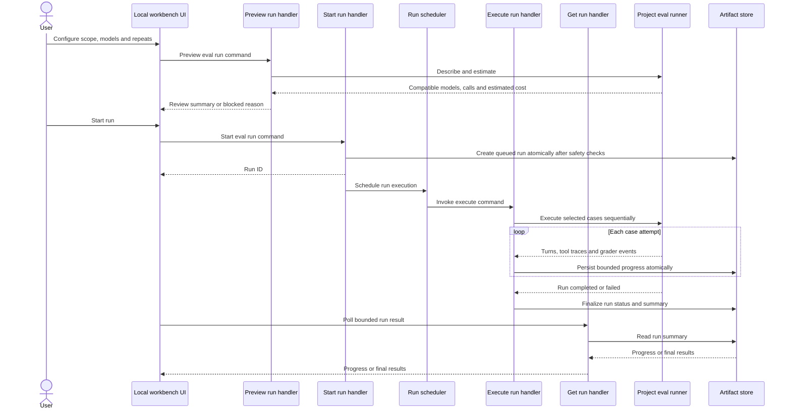

# Software Design Document: Production-Ready AI Evals

## Inputs and Authority

- Business requirements: `docs/features/production-ready-ai-evals/brd.md`
- Binding UX: `docs/features/production-ready-ai-evals/ux.md`
- Project architecture: `docs/architecture.md`
- Selected architecture guidance: `.agents/skills/command-pattern/SKILL.md`
- Code quality guidance: `.agents/skills/clean-code/SKILL.md`

This design covers `docs/features/production-ready-ai-evals/brd.md` REQ-01 through REQ-16. The UX mockups govern visible hierarchy, responsive behavior, run confirmation, single-model result presentation, and the guided repair flow.

## Design Summary

The feature remains inside the existing **Local Evals Workbench** deep module and its existing browser/server boundary. It replaces the static-output version-1 eval format with a version-2 executable suite contract and a provider-independent project runner protocol.

A coding agent, guided by the upgraded `eval-authoring` skill, discovers likely Evaluation Targets, obtains coverage approval, and creates:

- a version-2 suite definition;
- synthetic or redacted fixtures and references;
- a project-specific runner that adapts the target integration to Sibu's process protocol;
- mocked tool behavior and runner tests;
- the source-control exclusion required for local run artifacts.

At runtime, Sibu validates the suite, asks its project runner for compatible tested and Judge Models, previews calls and estimated cost, and executes the runner in a separate local process. The runner produces real target output, qualitative judgments, custom checks, conversation turns, and tool traces. Sibu performs standard deterministic assertions, normalizes evidence, and persists bounded file-backed run history.

Version 1 is removed rather than migrated or run in a compatibility mode. Discovery reports a clear unsupported-version diagnostic directing users to regenerate the suite.

## Architecture Fit and Boundaries

### Local Evals Workbench

The existing `local-evals-workbench` module continues to own:

- version-2 suite discovery and validation;
- model and run-preview orchestration;
- runner-process invocation and protocol validation;
- standard deterministic grading;
- run lifecycle, normalization, persisted artifacts, and bounded evidence reads;
- workbench view models and HTTP operation adapters;
- focused failure analysis, repair proposals, safe mutation, and rerun guidance.

It continues to exclude project-specific behavioral meaning, provider SDK behavior, hosted persistence, and autonomous mutation.

### Skill Guidance and Template Catalog

Eval discovery and suite generation remain prompt-owned capabilities executed by the user's coding agent, not by the Sibu runtime. The Template Catalog distributes the revised `eval-authoring` skill and its version-2 conventions. Template changes must follow Sibu template manifest and sync-note rules.

The skill may generate project-owned runner and test-support code after the user approves the coverage plan. Applicable language guidance, clean-code guidance, and the repository's normal code-change permission rules still apply.

### External project runner

The project runner is an external execution boundary, already recognized by `docs/architecture.md`. It owns translation between Sibu's stable protocol and the repo's actual AI SDK, prompt assembly, conversation state, model invocation, and framework-specific tool mocking. It is not a new Sibu deep module.

Sibu executes the runner without a shell. The runner command comes only from a validated suite inside the project, runs with the project root as its working directory, and receives a minimal environment containing declared variables rather than a serialized credential payload.

## Version-2 Eval Suite Contract

The suite remains JSON under the conventional `evals/` area. The normative schema should be represented by one runtime validator and one authoring reference so discovery, execution, templates, and tests cannot drift.

An illustrative suite shape is:

```json
{
  "version": 2,
  "kind": "sibu-eval-suite",
  "id": "support-agent",
  "name": "Support agent",
  "description": "Evaluates support decisions, conversation behavior, and tools.",
  "target": {
    "id": "support-agent",
    "kind": "agent",
    "path": "src/ai/support-agent.ts"
  },
  "coverage": {
    "categories": [
      { "id": "happy-path", "status": "covered" },
      { "id": "adversarial", "status": "partly-covered", "reason": "Bounded to refund abuse." }
    ],
    "gaps": [
      { "id": "live-crm-outage", "reason": "Real external tools are outside the local scope." }
    ]
  },
  "runner": {
    "command": ["node", "evals/runners/support-agent.mjs"],
    "requiredEnvironment": ["OPENAI_API_KEY"]
  },
  "testCases": [
    {
      "id": "verify-before-refund",
      "name": "Verifies ownership before refund",
      "turns": [
        { "role": "user", "content": "Refund order 123." }
      ],
      "toolMocks": [
        { "tool": "verifyOwnership", "result": { "verified": false } }
      ],
      "assertions": [
        { "id": "verification-first", "type": "tool-sequence", "value": ["verifyOwnership"] },
        { "id": "safe-response", "type": "rubric", "rubric": "Do not refund before ownership is verified.", "threshold": 0.8 }
      ]
    }
  ]
}
```

### Contract rules

- `version` must equal `2`; version 1 and unknown versions are rejected.
- IDs are stable, non-empty, and unique within their scope.
- All target, fixture, reference, runner, and artifact paths are relative and remain inside the project root after real-path resolution.
- The runner command is a non-empty argument array; shell syntax and redirections are invalid.
- Required environment entries contain names only. Values never enter suite files, browser state, logs, or artifacts.
- Coverage uses `covered`, `partly-covered`, `not-applicable`, or `known-gap`; omissions require a reason where the status is not fully covered.
- A test case has at least one turn and at least one assertion or grader.
- Fixtures and references may be inline when small or referenced under `evals/`; referenced content is resolved only after containment checks.
- Tool mocks describe deterministic input, result, error, or unexpected response behavior. Real tool credentials or live endpoints are invalid test-fixture content.
- Large or proprietary production prompts are referenced from their project-owned source rather than duplicated into fixtures.

## Project Runner Protocol

### Transport

Each runner invocation receives one JSON request on standard input and emits newline-delimited JSON events on standard output. Standard error is diagnostic-only and is captured with strict size bounds. The protocol has its own independent version so runner transport can evolve without changing suite semantics.

The process adapter enforces:

- no shell execution;
- project-root working directory;
- declared environment-variable forwarding without logging values;
- bounded request, event-line, stderr, output, trace, and total-artifact sizes;
- startup, idle, and overall execution timeouts;
- termination on protocol violation or limit breach;
- cleanup and an honest interrupted/error result on abnormal exit.

### Operations

#### `describe`

Returns runner identity, protocol version, supported capabilities, compatible Models Under Evaluation, compatible Judge Models, required environment-variable names, and whether cost estimation is available. It performs no model calls or external tool actions.

Sibu reconciles this response with suite needs. A suite containing rubrics is blocked when no compatible Judge Model is available.

#### `estimate`

Receives the selected scope, tested model, optional Judge Model, and repeat count. It returns expected target calls, expected judge calls, total expected calls, and either an estimated cost with currency or a reason estimation is unavailable. It must not perform model calls.

#### `execute`

Receives the normalized selected cases, selected tested model, optional Judge Model, repeat count, and a run identifier. The runner executes cases and repeats sequentially and emits:

- run started;
- case attempt started;
- conversation turn completed;
- tool interaction recorded;
- custom assertion completed;
- rubric judgment completed;
- case attempt completed;
- run diagnostic;
- run completed.

Every event includes the run ID and enough case/attempt identity to reject cross-run or out-of-order evidence. The runner returns rubric score, threshold result, and a concise evidence summary, never hidden chain-of-thought.

### Tool isolation

Generated runners replace production tool handlers with suite-declared mocks before target execution and record every requested tool name, normalized arguments, mock outcome, and ordering position. The process receives an explicit eval-mode marker.

Sibu validates the returned trace against tool assertions, but it does not provide an operating-system sandbox. Therefore runner tests must prove that mocked cases do not reach production tool clients. The dashboard and documentation must not imply stronger isolation than exists.

## Grading Model

### Sibu-owned deterministic assertions

The Local Evals Workbench evaluates consistent, provider-independent checks:

- output equals or contains;
- structured output satisfies JSON Schema;
- a tool was or was not called;
- tool arguments equal expected JSON or satisfy JSON Schema;
- tool-call sequence matches the required order;
- expected conversation-turn count or turn-local output condition.

For this version, JSON Schema grading supports a basic Draft 7 subset: `type`, `properties`, `required`, `items`, `additionalProperties`, `enum`, `const`, `minimum`, `maximum`, `minLength`, `maxLength`, `minItems`, and `maxItems`. Other keywords, including `$ref`, `$id`, `pattern`, and `patternProperties`, are reported as unsupported rather than evaluated. This keeps initial structured-output checks useful without reference resolution or regex execution on the workbench event loop.

Assertion evaluation operates on normalized runner evidence rather than SDK-specific objects. Failed checks retain bounded expected and actual previews plus references to full local evidence.

### Runner-owned grading

The project runner evaluates:

- rubric-based behavior through the selected Judge Model;
- project-specific custom assertions that cannot be expressed by standard checks.

Custom and rubric outcomes use the same normalized assertion-result contract as deterministic checks. Each reports pass/fail, optional score and threshold, concise evidence, diagnostics, and bounded artifact references.

### Repeats and aggregation

One execution is the default. Repeats are sequential. A required assertion fails the test case if it fails in any completed attempt; intermittent failure must not be hidden by an average. Results separately expose attempt pass rate, rubric-score distribution, latency, and cost so users can distinguish consistent from nondeterministic behavior.

A run with unfinished attempts is partial or interrupted, never passed.

## Command-Oriented Vertical Slices

All slices stay inside `local-evals-workbench`. Commands are immutable intent, handlers own semantic validation and orchestration, ports express required effects, and HTTP/UI code only adapts requests and results.

| Slice | Handler responsibility | Required ports |
| --- | --- | --- |
| Discover version-2 eval suites | Validate suite files, contained references, coverage, cases, and runner declaration; reject unsupported versions | Suite-definition reader, logger |
| Describe eval suite runtime | Load one valid suite and obtain compatible tested/Judge Models and capabilities without executing a run | Suite registry, runner descriptor, logger |
| Preview eval run | Validate scope/models/repeats, enforce artifact readiness, and obtain calls/cost estimate | Suite registry, runner descriptor, runner estimator, artifact-safety checker, logger |
| Start eval run | Revalidate preview-sensitive state, create an independently identified queued run record, and schedule execution | Suite registry, artifact store, artifact-safety checker, run scheduler, clock, logger |
| Execute eval run | Invoke the runner, consume bounded events, evaluate standard assertions, persist progress, and finalize status | Runner executor, assertion evaluator, artifact store, clock, logger |
| List eval runs | Return bounded suite history newest first | Artifact reader, logger |
| Get eval run | Return one bounded run summary or one selected case/assertion detail | Artifact reader, logger |

Existing failure-analysis, repair-proposal, apply-repair, and rerun slices remain separate operations. They change from an in-memory run lookup to the persisted artifact reader and require the explicit run ID. They continue to load exactly one selected Failed Assertion and its bounded evidence.

The workbench composition root constructs runner, filesystem, Git-safety, provider-assistance, scheduling, and logging adapters. HTTP routes do not construct adapters or read artifacts directly.

## Run Lifecycle and Concurrency

Run state is:

```text
queued -> running -> completed
                  -> partial
                  -> blocked
                  -> error
                  -> interrupted
```

Each run has its own identity and lifecycle. The workbench does not enforce a project-wide active-run limit or maintain an active-run pointer. Cases and repeats execute sequentially within a run, preserving deterministic tool mocks and understandable partial evidence. This design does not promise a cross-run scheduling policy. Running multiple Sibu processes against the same project at once is unsupported; the workbench does not coordinate their artifact writes.

The workbench UI disables starting another run while its current run is queued or running. This is a per-UI interaction rule, not server-side admission control: another tab or direct API client may start an independent run.

The local server schedules execution after the start handler has atomically created the queued manifest. Browser polling reads persisted progress, so refreshing or disconnecting the browser does not discard the run while Sibu remains active. Shutdown of the Sibu process during a run is outside this feature's supported lifecycle: Sibu does not promise to terminate the child runner or recover the in-progress manifest on restart.

Cancellation and parallel case execution within a run are outside this feature scope; cross-run scheduling is unspecified.

## File-Backed Artifact Design

Artifacts use the agreed project-local shape:

```text
evals/artifacts/
  <suite-id>/
    index.json
    <run-id>/
      run.json
      cases/
        <case-id>/
          <attempt-number>.json
```

- `run.json` contains configuration, lifecycle status, aggregates, bounded diagnostics, model identities, calls, cost, timing, and case summaries.
- Attempt files contain normalized turns, tool traces, assertion/grader results, and bounded output evidence.
- `index.json` contains only the small fields needed by run history.
- Writes use a sibling temporary file followed by atomic rename. The suite index is updated only after the corresponding run manifest is durable. In-process serialization protects shared index read-modify-write sequences, not a run-count limit; there is no persistent writer lock or `active.json` pointer. Atomic rename prevents partial-file publication but cannot prevent lost index updates from unsupported concurrent Sibu processes.
- Run IDs combine time-sortable identity with sufficient randomness; browser inputs cannot choose artifact paths.
- The store never follows artifact-directory symlinks outside the project.

### Git and context safety

Suite generation adds the root exclusion for `evals/artifacts/`. Before preview and again before starting a run, the artifact-safety adapter verifies that the path is inside the project, ignored by Git, and contains no tracked files. Missing Git capability, an absent ignore rule, or tracked artifacts blocks execution with repair guidance.

Sibu APIs return summaries and explicitly selected bounded evidence, never recursive artifact contents. Failure analysis and repair prompts receive only the selected assertion, relevant expected/actual excerpts, necessary tool/turn evidence, and named project files. Logs contain artifact IDs and safe metadata, not prompts, outputs, traces, credentials, or diffs.

These controls prevent accidental Sibu-driven Git and LLM-context pollution. They cannot prevent a user from deliberately overriding Git or asking an external agent to read ignored files.

## Main Execution Flow



The scheduler is an injected local port. Its adapter invokes the execute operation through module composition rather than importing another slice's internals.

## Guided Repair Flow

The binding UX is implemented as progressive state over one selected Failed Assertion:

1. `Get eval run` returns bounded actual, expected, turn, tool, and diagnostic evidence.
2. `Analyze failed assertion` sends only that evidence to the configured assistance provider.
3. `Draft eval repair proposal` reads only the named safe project files and returns a focused proposed diff or replacement.
4. The UI shows affected files, diff, rationale, and expected eval impact together.
5. `Apply approved eval repair` rechecks proposal identity, file safety, workflow readiness, and current file state before mutation.
6. A successful application records changed-file summaries and offers a new run command for the case or suite; it never marks the issue resolved before rerun.

Analysis and proposal state may remain workbench-session scoped. Source run evidence and final run history are durable. This avoids treating an unapproved model proposal as a durable project artifact.

## Browser and HTTP Behavior

The server exposes operation-shaped endpoints for suite discovery/description, run preview, run start, run status/history/detail, failure analysis, proposal drafting, proposal application, and rerun. Request parsers perform syntactic validation and size limits; handlers perform project, suite, model, run, and assertion validation.

The UI follows `docs/features/production-ready-ai-evals/ux.md`:

- single workspace rather than a run wizard;
- suite picker on compact screens and suite rail on expanded screens;
- one Model Under Evaluation per run, so version-2 results use a list-detail layout rather than the existing multi-model matrix;
- Judge Model control shown only for suites with rubrics;
- repeats collapsed and defaulted to once;
- mandatory review surface before start;
- persisted latest run and compact history;
- full-height compact detail sheet and persistent expanded detail pane;
- guided analysis, proposal, approval, and rerun without a manual prompt editor.

HTML remains server-rendered with progressively enhanced client behavior unless implementation evidence shows the existing approach cannot meet the binding UX. No frontend framework change is authorized by this design.

## Failure Behavior

| Condition | Required outcome |
| --- | --- |
| Version 1 or unknown suite version | Exclude it from runnable suites and report that version 2 must be regenerated; do not interpret old fields as version 2 |
| Malformed or unsafe suite/reference | Report the exact safe location and rule; do not invoke the runner |
| Required environment variable missing | Block describe/preview or run without exposing its value |
| Runner missing, incompatible, or invalid during `describe` | Keep other suites usable and show focused setup guidance |
| Judge Model absent for rubric cases | Block before run confirmation |
| Artifact path not ignored, contains tracked files, or cannot be verified | Block preview/start and explain how to restore isolation |
| Estimate unavailable | Show a reason and require explicit start confirmation, as defined by UX |
| Runner timeout, crash, malformed event, or size breach | Terminate the runner, preserve completed bounded evidence, and finalize error or partial status |
| Browser disconnects | Continue the local run while the Sibu process lives; allow status restoration from persisted artifacts |
| One attempt fails | Mark the case failed while preserving other attempts and the nondeterminism evidence |
| Assistance provider unavailable | Keep result evidence usable; disable analysis/proposal actions with recovery guidance |
| Project file changes after proposal | Refuse application and require a fresh proposal |

## Security and Privacy

- Treat suite JSON, runner events, browser requests, model output, tool traces, and provider responses as untrusted inputs.
- Validate all paths both lexically and by nearest existing real path before reads or writes.
- Spawn only validated command arrays with `shell: false`; never concatenate a browser value into a process command.
- Forward only base process requirements and suite-declared environment names. Never echo values.
- Escape all user/project/model-derived UI content.
- Bound stored and displayed evidence; retain references to full local evidence rather than embedding it in analysis prompts.
- Persist bounded runner output and traces as received in project-local, Git-ignored run artifacts; do not require redaction or a trusted provenance policy before saving. Never log credentials or suite-declared environment values. Raw results may contain sensitive content, so artifact isolation is not a confidentiality guarantee.
- The runner process is trusted project code, not a sandbox. Do not run suites from untrusted repositories.
- Repair target validation continues to reject root escapes, symlinks to outside paths, secrets, credentials, keys, tokens, and unapproved files.

## Operational Visibility

Structured events cover suite discovery, runner description, preview, run scheduling, runner start/exit, case-attempt completion, artifact persistence, final run outcome, failure analysis, proposal lifecycle, mutation, and rerun request.

Events include safe identifiers, scope, model IDs, repeat count, counts, duration, outcome, and reason codes. They exclude environment values, prompts, model output, tool arguments/results, traces, rubrics, diffs, and project-file contents. Expected blocked states and interruption are warnings or informational outcomes rather than generic exceptions.

## Quality Strategy

### Unit verification

- Version-2 schema, uniqueness, coverage, reference, command-array, and environment-name validation.
- Version-1 rejection with regeneration guidance.
- Model and Judge Model compatibility rules.
- Deterministic assertion evaluation for output, JSON Schema, tool call, arguments, order, and conversation turns.
- Strict repeat aggregation and partial/interrupted status rules.
- Command handlers with fake ports for success, blocked, partial, stale-state, and failure paths.
- View-model tests for the binding compact, medium, and expanded states, including guided repair progression.

### Adapter and integration verification

- Fixture runner processes for describe, estimate, successful execution, rubrics, custom checks, streamed progress, stderr, crash, timeout, malformed/out-of-order events, and size-limit breaches.
- Artifact-store tests for atomic writes, interrupted writes, same-process index consistency across independent runs, crash/restart without a persistent lock or active-run pointer, symlink/root escapes, stable history, and bounded reads. Do not claim a run-count limit or cross-process write coordination.
- Git-safety tests for ignored/unignored paths, tracked artifacts, missing Git capability, and time-of-check/time-of-use revalidation.
- HTTP parser and response tests for invalid IDs, oversized requests, escaping, polling, and restored history.
- A fixture project whose generated runner wraps a fake AI integration and mocked tools without network access.

### Acceptance and regression verification

- Reproduce the BRD acceptance scenarios AC-01 through AC-11 across the coding-agent authoring flow and local dashboard.
- Verify one single-turn suite, one multi-turn suite, one tool-using suite, one rubric suite, one repeated flaky case, and one interrupted run.
- Confirm source-control status remains clean after run artifacts are written.
- Confirm analysis receives only one selected assertion's bounded evidence.
- Preserve existing approval-gated repair, project-root safety, workflow readiness, and rerun behavior.

### Risk-focused verification

- Property/fuzz tests for NDJSON event parsing, event ordering, path containment, and normalization of arbitrary model output.
- Mutation testing is valuable for path safety, approval gating, and strict repeat aggregation because false positives would undermine trust.
- Manual keyboard and screen-reader checks cover focus restoration, sheets/dialogs, live progress, result navigation, diff review, and rerun actions.

### Planned commands

The implementation should pass:

```text
pnpm check
pnpm test
pnpm build
pnpm run validate:packed-runtime
```

Template changes must also pass the repository's template-manifest, lifecycle, init/sync, and packed-runtime validations. These are planned checks; they were not executed while writing this design.

## Requirement Coverage by Decision

- REQ-01 through REQ-05: upgraded agent guidance, target confirmation, approved coverage, and version-2 generation contract.
- REQ-06 and REQ-07: multi-turn turns, runner-owned conversation state, mocked tools, and normalized tool traces.
- REQ-08: Sibu deterministic assertion engine plus runner-owned Judge Model and custom grading.
- REQ-09 through REQ-11: describe, preview, compatible single-model selection, repeats, and estimate operations.
- REQ-12 and REQ-13: normalized evidence, atomic file-backed history, Git readiness, bounded reads, and UX list-detail views.
- REQ-14: existing command slices adapted to durable run IDs and the binding guided repair flow.
- REQ-15: synthetic/redacted fixture authoring, environment isolation, and bounded raw run evidence in Git-ignored local artifacts without a redaction prerequisite.
- REQ-16: authoring skill hard stop when repo evidence cannot establish expected behavior.

## Risks and Tradeoffs

- **Generated runner quality:** arbitrary frameworks require project-specific adaptation. The standard process protocol contains variation, but generated runner tests remain essential.
- **Mock isolation:** without an OS sandbox, Sibu cannot independently prove that a faulty runner never contacts a real tool. Explicit mocks, minimal environment, eval mode, and no-network fixture tests reduce but do not eliminate this risk.
- **Sequential cases within a run:** improves determinism and recovery but makes large suites slower. No project-wide active-run limit or cross-run scheduling guarantee is part of this design.
- **Strict repeat aggregation:** exposes intermittent failures honestly but may produce more failed runs than average-score approaches.
- **Filesystem history:** preserves local ownership and portability but requires careful atomicity, cleanup guidance, and bounded indexing. Concurrent Sibu processes using one project are unsupported and may lose index updates; users should run one workbench process per project. A crash must not leave a persistent writer lock or active-run pointer that blocks later saves.
- **Sibu shutdown during a run:** deferred. A child runner may continue after Sibu stops, including possible model calls and cost; in-progress evidence may require manual recovery. This does not weaken timeout, crash, or protocol-failure handling while Sibu is active.
- **Raw result retention:** local run artifacts may contain secrets or production data emitted by the project runner. Git-ignore keeps them out of normal commits but does not protect the local files from other processes or deliberate sharing; users choose which suites to run and manage the artifact directory.
- **Dynamic model discovery:** keeps provider choice in the project but makes runner availability part of dashboard readiness.
- **No version-1 compatibility:** simplifies the trustworthy contract but requires existing suites to be regenerated.
- **Server-rendered UI evolution:** minimizes dependency and packaging changes, but the implementation must split cohesive rendering and client responsibilities to respect source-file size limits and avoid a monolithic script.

## Mermaid Validation

The sequence diagram was parsed locally with Mermaid 11.12.0 using `mermaid.parse`; parsing passed. It was also checked for declared participants, valid message direction, and consistency with the command/port boundaries. Rendering was not performed, so this validates syntax rather than visual layout.
