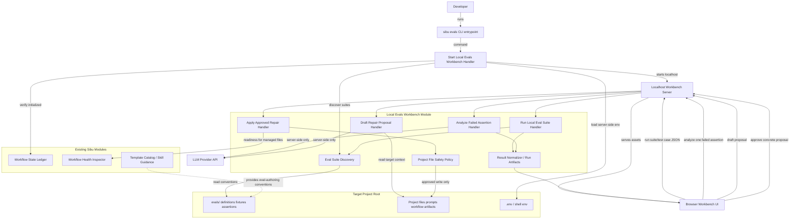
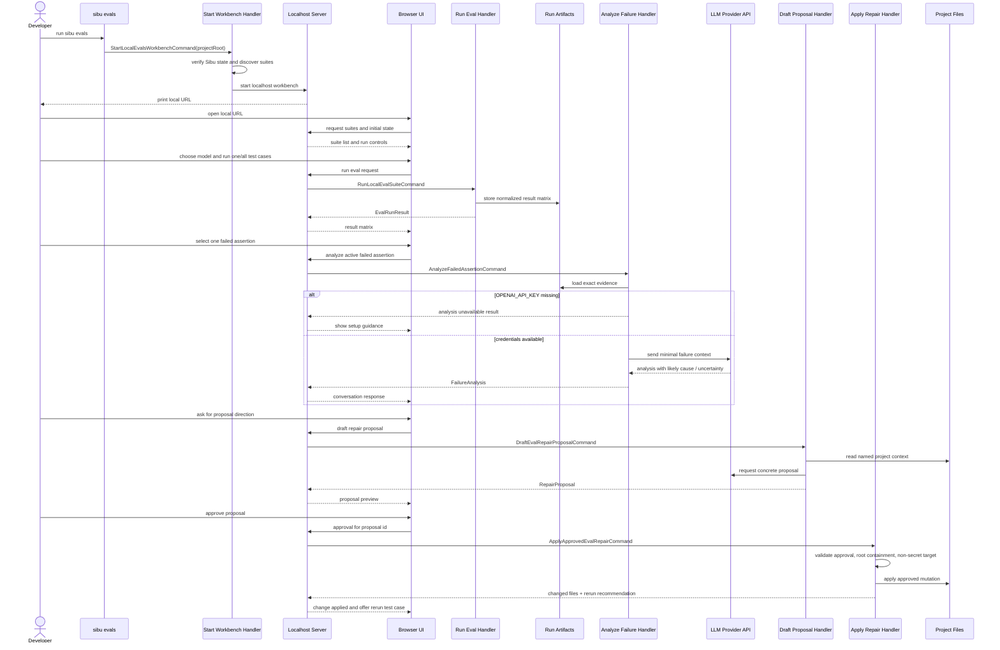
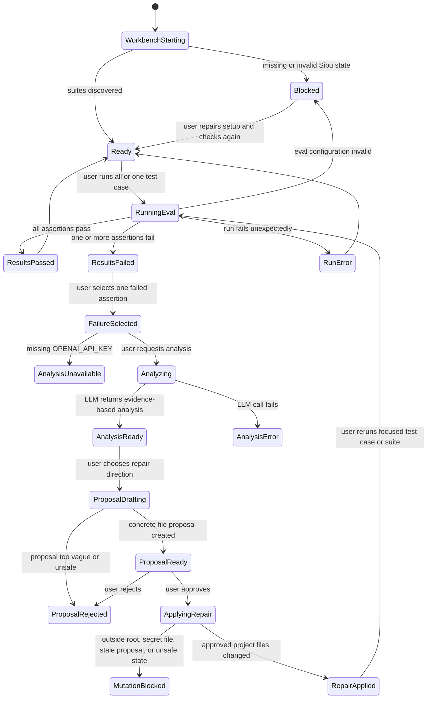

# Technical Design Diagrams: Sibu Local Evals Workbench

## High-Level Architecture Diagram

```mermaid
flowchart TB
  User[Developer]
  CLI[sibu evals CLI entrypoint]
  Start[Start Local Evals Workbench Handler]
  Server[Localhost Workbench Server]
  UI[Browser Workbench UI]

  subgraph LocalEvals[Local Evals Workbench Module]
    Discovery[Eval Suite Discovery]
    Runner[Run Local Eval Suite Handler]
    Results[Result Normalizer / Run Artifacts]
    Analysis[Analyze Failed Assertion Handler]
    Proposal[Draft Repair Proposal Handler]
    Apply[Apply Approved Repair Handler]
    Safety[Project File Safety Policy]
  end

  subgraph ExistingSibu[Existing Sibu Modules]
    State[Workflow State Ledger]
    Health[Workflow Health Inspector]
    Templates[Template Catalog / Skill Guidance]
  end

  subgraph Project[Target Project Root]
    Evals[evals/ definitions fixtures assertions]
    Files[Project files prompts workflow artifacts]
    Env[.env / shell env]
  end

  Provider[LLM Provider API]

  User -->|runs| CLI
  CLI -->|command| Start
  Start -->|verify initialized| State
  Start -->|discover suites| Discovery
  Discovery -->|read conventions| Evals
  Start -->|load server-side env| Env
  Start -->|starts localhost| Server
  Server -->|serves assets| UI
  UI -->|run suite/test case JSON| Server
  Server --> Runner
  Runner --> Discovery
  Runner --> Results
  Results --> UI
  UI -->|analyze one failed assertion| Server
  Server --> Analysis
  Analysis --> Results
  Analysis -->|server-side only| Provider
  UI -->|draft proposal| Server
  Server --> Proposal
  Proposal -->|read target context| Files
  Proposal -->|server-side only| Provider
  UI -->|approve concrete proposal| Server
  Server --> Apply
  Apply --> Safety
  Apply -->|readiness for managed files| Health
  Safety -->|approved write only| Files
  Templates -. provides eval-authoring conventions .-> Evals
```

## Sequence Diagram

```mermaid
sequenceDiagram
  actor Dev as Developer
  participant CLI as sibu evals
  participant Start as Start Workbench Handler
  participant Server as Localhost Server
  participant UI as Browser UI
  participant Run as Run Eval Handler
  participant Artifacts as Run Artifacts
  participant Analyze as Analyze Failure Handler
  participant LLM as LLM Provider API
  participant Proposal as Draft Proposal Handler
  participant Apply as Apply Repair Handler
  participant Files as Project Files

  Dev->>CLI: run sibu evals
  CLI->>Start: StartLocalEvalsWorkbenchCommand(projectRoot)
  Start->>Start: verify Sibu state and discover suites
  Start->>Server: start localhost workbench
  Server-->>Dev: print local URL
  Dev->>UI: open local URL
  UI->>Server: request suites and initial state
  Server-->>UI: suite list and run controls

  Dev->>UI: choose model and run one/all test cases
  UI->>Server: run eval request
  Server->>Run: RunLocalEvalSuiteCommand
  Run->>Artifacts: store normalized result matrix
  Run-->>Server: EvalRunResult
  Server-->>UI: result matrix

  Dev->>UI: select one failed assertion
  UI->>Server: analyze active failed assertion
  Server->>Analyze: AnalyzeFailedAssertionCommand
  Analyze->>Artifacts: load exact evidence
  alt OPENAI_API_KEY missing
    Analyze-->>Server: analysis unavailable result
    Server-->>UI: show setup guidance
  else credentials available
    Analyze->>LLM: send minimal failure context
    LLM-->>Analyze: analysis with likely cause / uncertainty
    Analyze-->>Server: FailureAnalysis
    Server-->>UI: conversation response
  end

  Dev->>UI: ask for proposal direction
  UI->>Server: draft repair proposal
  Server->>Proposal: DraftEvalRepairProposalCommand
  Proposal->>Files: read named project context
  Proposal->>LLM: request concrete proposal
  Proposal-->>Server: RepairProposal
  Server-->>UI: proposal preview

  Dev->>UI: approve proposal
  UI->>Server: approval for proposal id
  Server->>Apply: ApplyApprovedEvalRepairCommand
  Apply->>Apply: validate approval, root containment, non-secret target
  Apply->>Files: apply approved mutation
  Apply-->>Server: changed files + rerun recommendation
  Server-->>UI: change applied and offer rerun test case
```

## Data Model / State Diagram

```mermaid
stateDiagram-v2
  [*] --> WorkbenchStarting
  WorkbenchStarting --> Blocked: missing or invalid Sibu state
  WorkbenchStarting --> Ready: suites discovered

  Ready --> RunningEval: user runs all or one test case
  RunningEval --> ResultsPassed: all assertions pass
  RunningEval --> ResultsFailed: one or more assertions fail
  RunningEval --> RunError: run fails unexpectedly
  RunningEval --> Blocked: eval configuration invalid

  ResultsFailed --> FailureSelected: user selects one failed assertion
  FailureSelected --> AnalysisUnavailable: missing OPENAI_API_KEY
  FailureSelected --> Analyzing: user requests analysis
  Analyzing --> AnalysisReady: LLM returns evidence-based analysis
  Analyzing --> AnalysisError: LLM call fails

  AnalysisReady --> ProposalDrafting: user chooses repair direction
  ProposalDrafting --> ProposalReady: concrete file proposal created
  ProposalDrafting --> ProposalRejected: proposal too vague or unsafe

  ProposalReady --> ProposalRejected: user rejects
  ProposalReady --> ApplyingRepair: user approves
  ApplyingRepair --> MutationBlocked: outside root, secret file, stale proposal, or unsafe state
  ApplyingRepair --> RepairApplied: approved project files changed
  RepairApplied --> RunningEval: user reruns focused test case or suite

  ResultsPassed --> Ready
  RunError --> Ready
  Blocked --> Ready: user repairs setup and checks again
```
